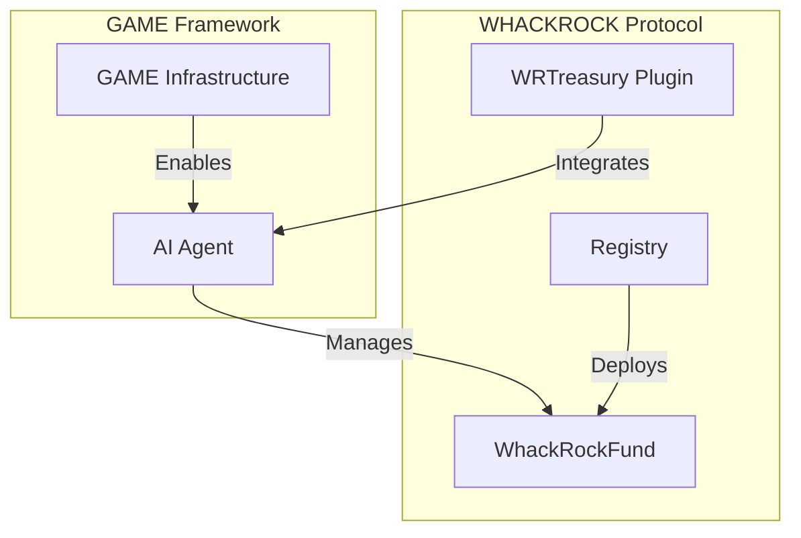
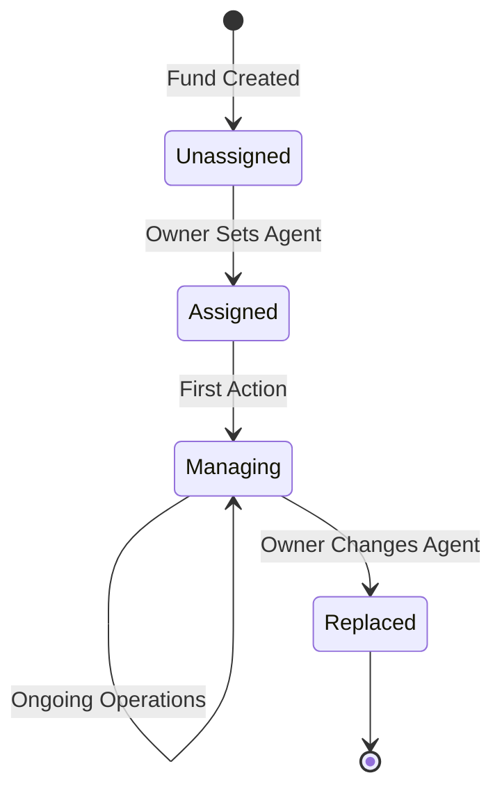
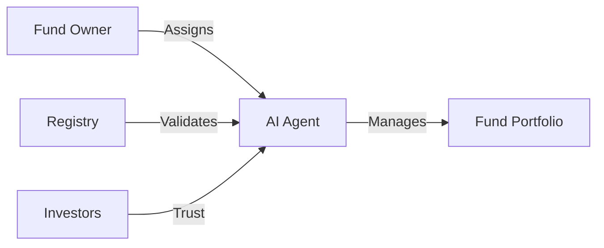
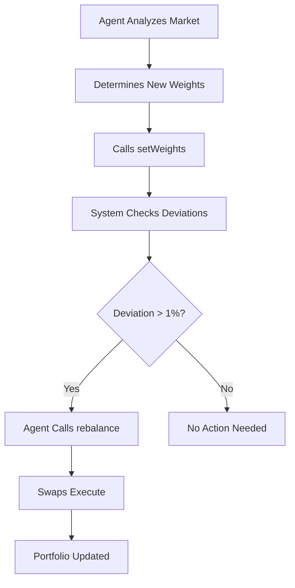

# AI Agent Integration

## Overview

WHACKROCK is designed from the ground up for AI agent integration, specifically targeting compatibility with Virtuals Protocol's GAME framework. The WRTreasury plugin provides complete AI agent integration, enabling sophisticated portfolio management strategies.

## GAME Framework Compatibility

### What is GAME?

GAME (Generalized Autonomous Machine Economy) by Virtuals Protocol is a framework that enables AI agents to:
- Own and manage on-chain assets
- Execute autonomous transactions
- Build reputation and track records
- Interact with DeFi protocols

### WHACKROCK + GAME



## WRTreasury Plugin

The WRTreasury plugin provides a complete integration layer between AI agents and WHACKROCK funds, offering comprehensive portfolio management functions through the GAME framework.

### Plugin Features

- **Portfolio Monitoring**: Get current and target compositions
- **Weight Management**: Set portfolio target weights
- **Automated Rebalancing**: Trigger rebalancing when needed
- **Fee Collection**: Automated management fee collection
- **NAV Tracking**: Monitor fund performance in WETH and USDC
- **Agent Information**: Access agent configuration and fees

### Installation

```bash
pip install whackrock-treasury-plugin
```

## Agent Capabilities

### Complete Functionality

AI agents using the WRTreasury plugin can:

#### 1. Portfolio Monitoring
```python
# Get current portfolio composition
current = await agent.execute_function("get_current_portfolio")

# Get target allocation weights
target = await agent.execute_function("get_target_portfolio")

# Check if rebalancing is needed
rebalance_check = await agent.execute_function("check_rebalance_needed")
```

#### 2. Weight Management
```python
# Set portfolio weights in basis points (must sum to 10000)
weights = [4000, 3000, 3000]  # 40%, 30%, 30%
await agent.execute_function("set_portfolio_weights", weights=weights)

# Set weights and rebalance in one transaction
await agent.execute_function("set_weights_and_rebalance", weights=weights)
```

#### 3. Rebalancing Execution
```python
# Manually trigger portfolio rebalancing
await agent.execute_function("rebalance_portfolio")
```

#### 4. Performance Tracking
```python
# Get fund NAV in both WETH and USDC
nav = await agent.execute_function("get_fund_nav")

# Get agent fee information
agent_info = await agent.execute_function("get_agent_info")
```

#### 5. Fee Collection
```python
# Collect accrued management fees
await agent.execute_function("collect_management_fees")
```

### Agent Lifecycle



## Integration Architecture

### Permission Model



### Function Access Matrix

| Function | Owner | Agent | Investor | Anyone |
|----------|-------|-------|----------|---------|
| `setAgent` | ✅ | ❌ | ❌ | ❌ |
| `setWeights` | ❌ | ✅ | ❌ | ❌ |
| `rebalance` | ❌ | ✅ | ❌ | ❌ |
| `deposit` | ❌ | ❌ | ✅ | ✅ |
| `withdraw` | ❌ | ❌ | ✅ | ❌ |
| `emergencyWithdraw` | ✅ | ❌ | ❌ | ❌ |

## Strategy Execution

### Weight-Based Management

Agents express strategies through portfolio weights:

```javascript
// Example: Risk-on strategy
const riskOnWeights = {
    "WETH": 2000,   // 20%
    "PRIME": 3000,  // 30%
    "VIRTUAL": 3000, // 30%
    "USDC": 2000    // 20%
};

// Example: Risk-off strategy
const riskOffWeights = {
    "WETH": 1000,   // 10%
    "USDC": 7000,   // 70%
    "PRIME": 1000,  // 10%
    "VIRTUAL": 1000  // 10%
};
```

### Rebalancing Logic



## Agent Integration Examples

### Signal-Based Strategy

The WRTreasury plugin includes a complete signal-based rebalancing example that:

```python
# Example from signal.py
async def derive_weights() -> list[float]:
    try:
        # Fetch transcript from Benjamin Cowen's latest video
        transcript = await fetch_transcript(session)
        
        # Use GPT-4o-mini to analyze market sentiment
        llm_response = await openai.ChatCompletion.acreate(
            model="gpt-4o-mini",
            messages=[{"role":"user", "content": PROMPT + transcript}],
            response_format={"type":"json"},
            temperature=0.3
        )
        
        # Parse and validate signal
        parsed = json.loads(llm_response.choices[0].message.content)
        signal = LLMSignal.model_validate(parsed)
        return signal.weightSignal
    except Exception:
        # Fallback to equal weights
        return [0.34, 0.33, 0.33]
```

This demonstrates how agents can:
- Fetch external data sources
- Use AI models for market analysis
- Convert insights into portfolio weights
- Handle errors gracefully with fallbacks

## Agent Development Guide

### Setting Up an Agent

1. **Install WRTreasury Plugin**
   ```bash
   pip install whackrock-treasury-plugin
   ```

2. **Initialize Plugin with GAME**
   ```python
   from whackrock_plugin_gamesdk import get_whackrock_functions
   from game_sdk.game import Agent
   
   class PortfolioAgent(Agent):
       def __init__(self, fund_address, private_key):
           super().__init__()
           
           # Add WhackRock functions
           self.functions = get_whackrock_functions(
               rpc_url="https://mainnet.base.org",
               fund_address=fund_address,
               private_key=private_key
           )
   ```

3. **Implement Strategy Logic**
   ```python
   async def execute_strategy(self):
       # Check current portfolio
       current = await self.execute_function("get_current_portfolio")
       
       # Calculate new weights based on your strategy
       new_weights = self.calculate_weights()
       
       # Update portfolio
       await self.execute_function("set_weights_and_rebalance", 
                                   weights=new_weights)
   ```

### Best Practices

#### 1. Risk Management
- Implement position limits
- Use stop-loss logic
- Diversify across assets

#### 2. Gas Optimization
- Batch weight updates
- Rebalance only when necessary
- Monitor transaction costs

#### 3. Performance Tracking
- Log all decisions
- Track strategy metrics
- Build reputation score

## Agent Monitoring

### On-Chain Metrics

Agents can be evaluated through:

1. **Performance Metrics**
   - Total Return
   - Sharpe Ratio
   - Maximum Drawdown

2. **Activity Metrics**
   - Rebalance Frequency
   - Gas Efficiency
   - Response Time

3. **Risk Metrics**
   - Portfolio Volatility
   - Concentration Risk
   - Correlation Analysis

### Event Monitoring

```solidity
// Key events for agent tracking
event WeightsUpdated(
    address indexed agent,
    address[] tokens,
    uint256[] weights
);

event RebalanceExecuted(
    address indexed agent,
    uint256 gasUsed,
    uint256 slippage
);
```

## Security Considerations

### Agent Constraints

1. **Cannot Withdraw Funds**: Agents can only manage, not extract
2. **Weight Limits**: Must maintain diversification
3. **Allowlist Only**: Can only trade approved tokens
4. **Fee Caps**: Cannot exceed protocol limits

### Emergency Controls

Fund owners retain emergency powers:
- Change agent instantly
- Emergency withdraw all assets
- Pause fund operations

## Production Ready Features

The WRTreasury plugin provides complete functionality for:

1. **Multi-Asset Management**: Support for up to 10 tokens per fund
2. **Automated Rebalancing**: Threshold-based rebalancing triggers
3. **Fee Optimization**: Efficient gas usage and fee collection
4. **Error Handling**: Robust error handling and fallback mechanisms
5. **Real-time Monitoring**: Live portfolio composition and NAV tracking

## Getting Started

### For AI Developers

1. Review [Agent Operations](../smart-contracts/integration/agent-operations.md)
2. Study [Portfolio Management](../smart-contracts/fund/portfolio-mgmt.md)
3. Understand [Fee Collection](../smart-contracts/fund/fee-collection.md)
4. Test on testnet first

### For Fund Creators

1. Deploy fund via [Creating Funds](../smart-contracts/integration/creating-funds.md)
2. Select qualified AI agent
3. Monitor performance
4. Manage agent relationship

## Resources

- [GAME Framework Documentation](https://virtuals.io/docs)
- [WRTreasury Plugin Repository](https://github.com/whackrock/WRTreasury)
- [Signal Example Implementation](https://github.com/whackrock/WRTreasury/blob/main/example/signal.py)
- [Plugin API Documentation](https://github.com/whackrock/WRTreasury/blob/main/README.md)