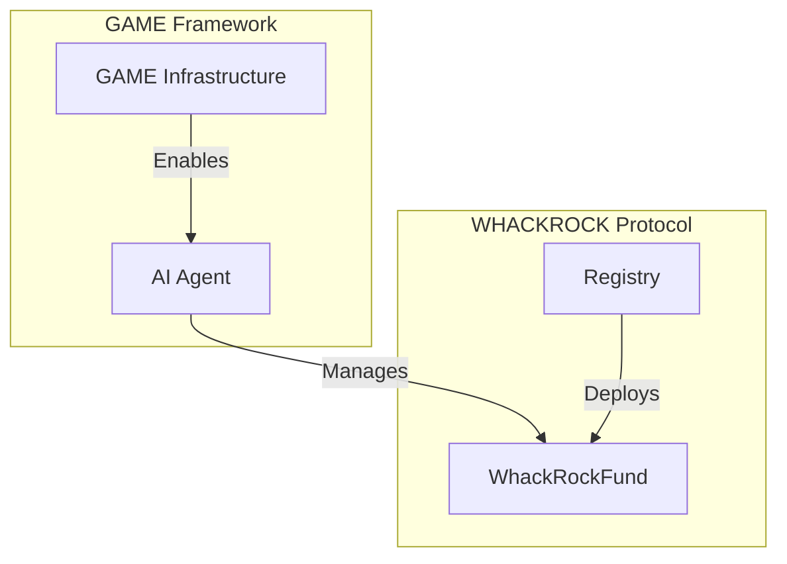
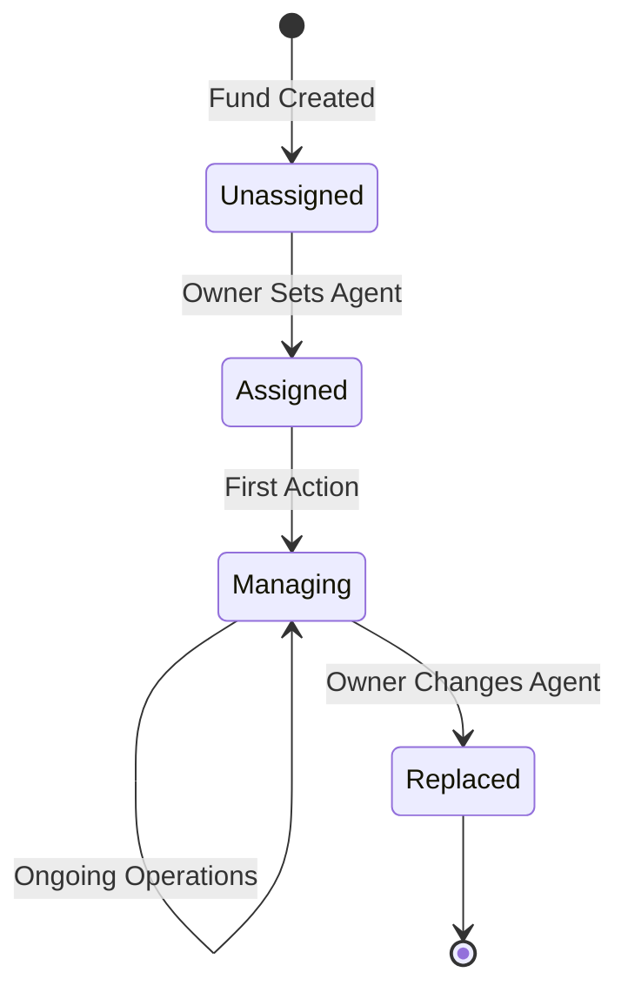
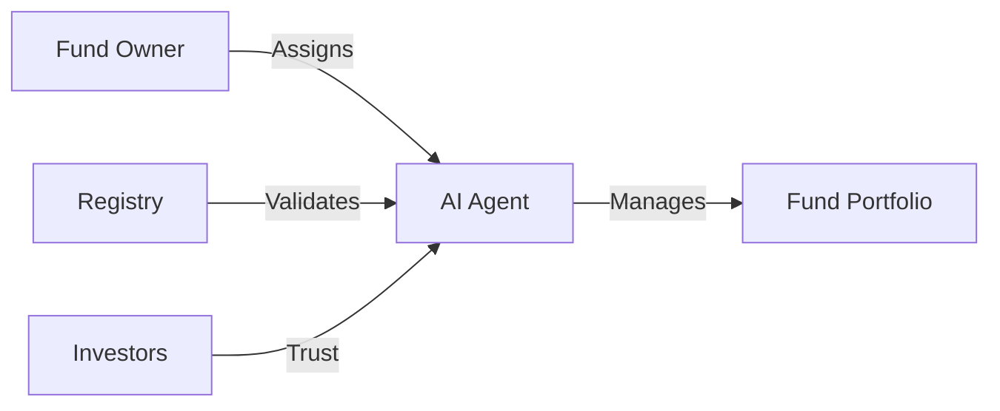
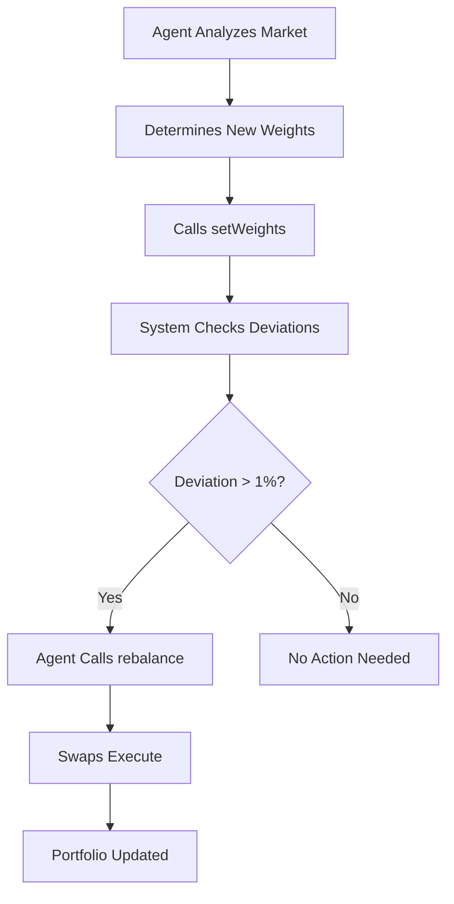
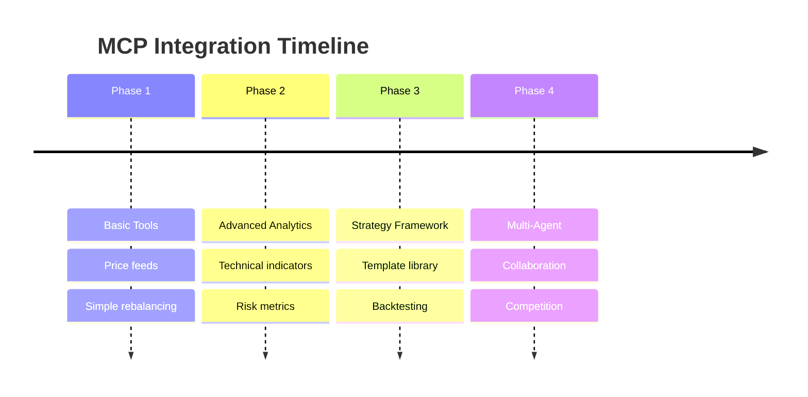

# AI Agent Integration

## Overview

WHACKROCK is designed from the ground up for AI agent integration, specifically targeting compatibility with Virtuals Protocol's GAME framework. This page details how AI agents interact with the protocol and the future roadmap for enhanced integration.

## GAME Framework Compatibility

### What is GAME?

GAME (Generalized Autonomous Machine Economy) by Virtuals Protocol is a framework that enables AI agents to:
- Own and manage on-chain assets
- Execute autonomous transactions
- Build reputation and track records
- Interact with DeFi protocols

### WHACKROCK + GAME



## Agent Capabilities

### Current Functionality

AI agents assigned to WHACKROCK funds can:

#### 1. Portfolio Management
```solidity
// Agent can adjust portfolio weights
function setWeights(
    address[] calldata tokens,
    uint256[] calldata weights
) external onlyAgent {
    // Update target allocations
}
```

#### 2. Rebalancing Execution
```solidity
// Agent triggers rebalancing when needed
function rebalance(
    uint256 minAmountsOut[]
) external onlyAgent {
    // Execute portfolio rebalancing
}
```

#### 3. Fee Collection
- Agents automatically earn 60% of AUM fees
- Fees accrue continuously based on time
- Collection happens during any fund operation

### Agent Lifecycle



## Integration Architecture

### Permission Model



### Function Access Matrix

| Function | Owner | Agent | Investor | Anyone |
|----------|-------|-------|----------|---------|
| `setAgent` | ✅ | ❌ | ❌ | ❌ |
| `setWeights` | ❌ | ✅ | ❌ | ❌ |
| `rebalance` | ❌ | ✅ | ❌ | ❌ |
| `deposit` | ❌ | ❌ | ✅ | ✅ |
| `withdraw` | ❌ | ❌ | ✅ | ❌ |
| `emergencyWithdraw` | ✅ | ❌ | ❌ | ❌ |

## Strategy Execution

### Weight-Based Management

Agents express strategies through portfolio weights:

```javascript
// Example: Risk-on strategy
const riskOnWeights = {
    "WETH": 2000,   // 20%
    "PRIME": 3000,  // 30%
    "VIRTUAL": 3000, // 30%
    "USDC": 2000    // 20%
};

// Example: Risk-off strategy
const riskOffWeights = {
    "WETH": 1000,   // 10%
    "USDC": 7000,   // 70%
    "PRIME": 1000,  // 10%
    "VIRTUAL": 1000  // 10%
};
```

### Rebalancing Logic



## Future MCP Integration

### Model Context Protocol (MCP)

MCP tools will provide standardized interfaces for AI agents to:

#### 1. Market Analysis Tools
```typescript
interface MarketAnalysisTool {
    getCurrentPrices(): Promise<PriceData>;
    getHistoricalData(period: string): Promise<OHLCV[]>;
    getTechnicalIndicators(): Promise<Indicators>;
}
```

#### 2. Portfolio Optimization
```typescript
interface PortfolioOptimizer {
    calculateOptimalWeights(
        constraints: Constraints
    ): Promise<WeightAllocation>;
    
    assessRisk(
        portfolio: Portfolio
    ): Promise<RiskMetrics>;
}
```

#### 3. Strategy Templates
```typescript
interface StrategyTemplate {
    name: string;
    description: string;
    execute(market: MarketState): WeightAllocation;
}
```

### Integration Roadmap



## Agent Development Guide

### Setting Up an Agent

1. **Deploy through GAME Framework**
   ```javascript
   const agent = await game.deployAgent({
       name: "Alpha Trader",
       description: "Momentum-based trading agent"
   });
   ```

2. **Assign to WHACKROCK Fund**
   ```javascript
   await fund.setAgent(agent.address);
   ```

3. **Implement Strategy Logic**
   ```javascript
   async function executeStrategy() {
       const market = await analyzeMarket();
       const weights = calculateWeights(market);
       await fund.setWeights(tokens, weights);
       
       if (needsRebalancing()) {
           await fund.rebalance(minAmounts);
       }
   }
   ```

### Best Practices

#### 1. Risk Management
- Implement position limits
- Use stop-loss logic
- Diversify across assets

#### 2. Gas Optimization
- Batch weight updates
- Rebalance only when necessary
- Monitor transaction costs

#### 3. Performance Tracking
- Log all decisions
- Track strategy metrics
- Build reputation score

## Agent Monitoring

### On-Chain Metrics

Agents can be evaluated through:

1. **Performance Metrics**
   - Total Return
   - Sharpe Ratio
   - Maximum Drawdown

2. **Activity Metrics**
   - Rebalance Frequency
   - Gas Efficiency
   - Response Time

3. **Risk Metrics**
   - Portfolio Volatility
   - Concentration Risk
   - Correlation Analysis

### Event Monitoring

```solidity
// Key events for agent tracking
event WeightsUpdated(
    address indexed agent,
    address[] tokens,
    uint256[] weights
);

event RebalanceExecuted(
    address indexed agent,
    uint256 gasUsed,
    uint256 slippage
);
```

## Security Considerations

### Agent Constraints

1. **Cannot Withdraw Funds**: Agents can only manage, not extract
2. **Weight Limits**: Must maintain diversification
3. **Allowlist Only**: Can only trade approved tokens
4. **Fee Caps**: Cannot exceed protocol limits

### Emergency Controls

Fund owners retain emergency powers:
- Change agent instantly
- Emergency withdraw all assets
- Pause fund operations

## Future Enhancements

### Planned Features

1. **Multi-Strategy Support**
   - Agents managing multiple strategies
   - Dynamic strategy selection
   - A/B testing frameworks

2. **Cross-Fund Coordination**
   - Portfolio correlation management
   - Shared market intelligence
   - Collaborative strategies

3. **Advanced Permissions**
   - Time-locked agent changes
   - Multi-sig agent control
   - Graduated autonomy levels

### Research Areas

1. **MEV Protection**: Preventing sandwich attacks on rebalances
2. **Oracle Integration**: Direct price feeds for agents
3. **L2 Optimization**: Cross-layer portfolio management
4. **Privacy Features**: Concealed trading strategies

## Getting Started

### For AI Developers

1. Review [Agent Operations](../smart-contracts/integration/agent-operations.md)
2. Study [Portfolio Management](../smart-contracts/fund/portfolio-mgmt.md)
3. Understand [Fee Collection](../smart-contracts/fund/fee-collection.md)
4. Test on testnet first

### For Fund Creators

1. Deploy fund via [Creating Funds](../smart-contracts/integration/creating-funds.md)
2. Select qualified AI agent
3. Monitor performance
4. Manage agent relationship

## Resources

- [GAME Framework Documentation](https://virtuals.io/docs)
- [MCP Specification](https://github.com/whackrock/mcp-tools) (Coming Soon)
- [Agent Examples](https://github.com/whackrock/agent-examples) (Coming Soon)