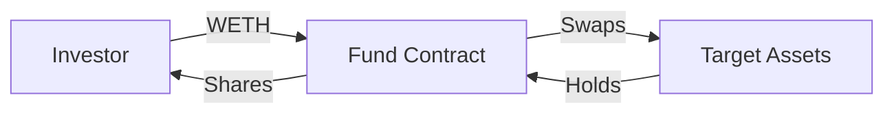
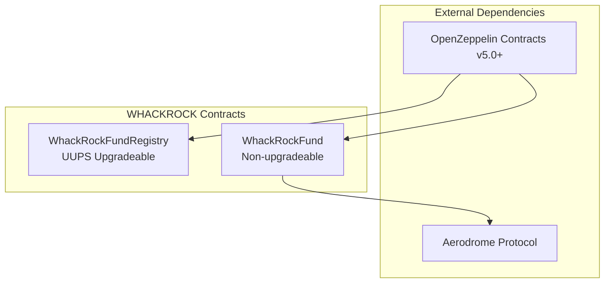
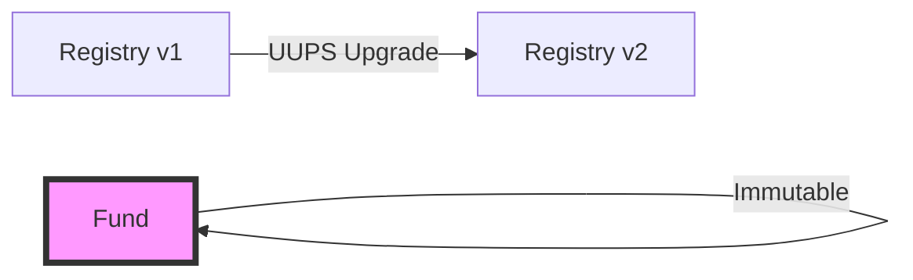
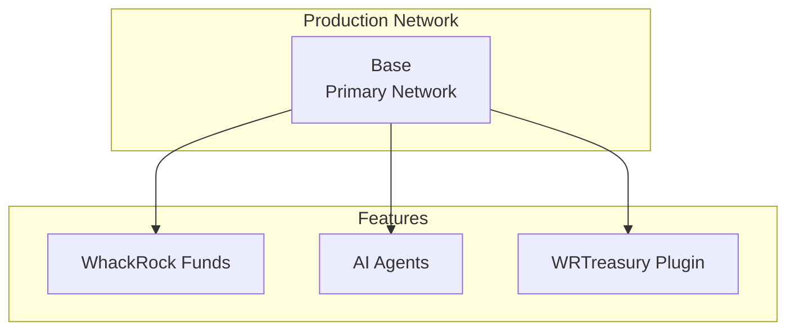
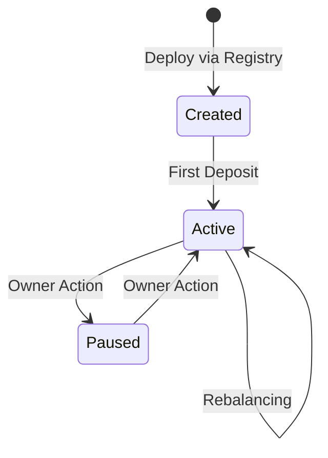
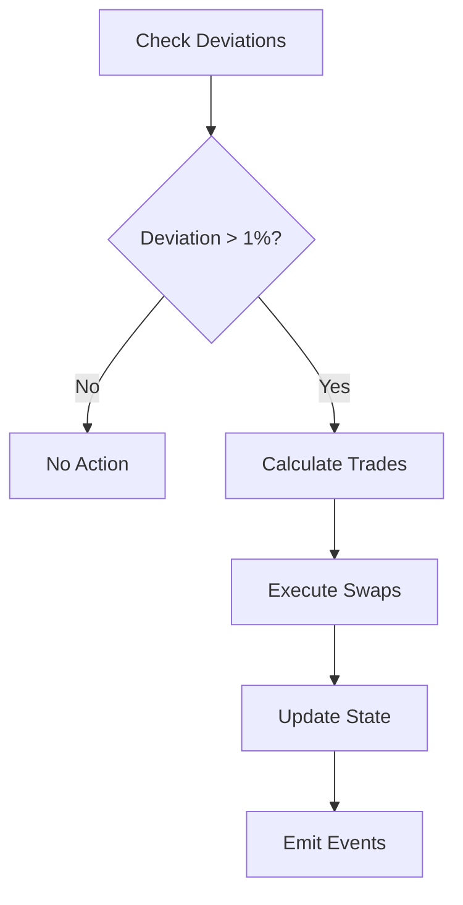

# Protocol Architecture

## System Overview

WHACKROCK implements a sophisticated three-tier architecture designed for security, scalability, and AI integration.

**Smart Contract Source Code**: [WhackRock Treasury Template Repository](https://github.com/WhackRock/whackrock-treasury-template)

```
┌─────────────────────────────────────────────────────────────┐
│                     WhackRockFundRegistry                    │
│  • Fund Creation & Registration                              │
│  • Token Allowlist Management                                │
│  • Fee Configuration                                         │
└──────────────────┬──────────────────────────────────────────┘
                   │ Deploys
                   ▼
┌─────────────────────────────────────────────────────────────┐
│                      WhackRockFund                           │
│  • ERC20 Tokenized Shares                                   │
│  • Multi-Asset Portfolio Management                          │
│  • Automated Rebalancing                                     │
│  • Fee Collection & Distribution                             │
└──────────────────┬──────────────────────────────────────────┘
                   │ Managed by
                   ▼
┌─────────────────────────────────────────────────────────────┐
│                    AI Agents (via GAME)                      │
│  • Portfolio Strategy Execution                              │
│  • Market Analysis & Decision Making                         │
│  • WRTreasury Plugin Integration                             │
└─────────────────────────────────────────────────────────────┘
```

## Core Components

### WhackRockFundRegistry

The Registry serves as the protocol's control center and implements critical functionality:

#### Fund Factory Pattern
- **Standardized Deployment**: All funds are created with consistent parameters and security features
- **Immutable Parameters**: Core fund settings cannot be changed after deployment
- **Symbol Uniqueness**: Prevents confusion by enforcing unique fund symbols

#### Token Allowlist Management
- **Curated Assets**: Only approved tokens can be held by funds
- **Quality Control**: Prevents exposure to malicious or low-quality assets
- **Dynamic Updates**: Registry owner can add/remove tokens as needed

#### Fee Configuration
- **Creation Fee**: One-time USDC payment for fund deployment
- **AUM Fee Limits**: Maximum annual fee caps to protect investors
- **Protocol Revenue**: Configurable fee recipient for sustainability

### WhackRockFund

Each fund is an independent smart contract with sophisticated features:

#### ERC20 Share Implementation
```solidity
// Simplified view of share mechanics
contract WhackRockFund is ERC20 {
    // Shares represent proportional ownership
    // 1 share = proportional claim on all assets
    function deposit(uint256 wethAmount) external {
        // Calculate shares based on current NAV
        uint256 shares = calculateShares(wethAmount);
        _mint(msg.sender, shares);
    }
}
```

#### Portfolio Management System
- **Multi-Asset Support**: Up to 10 tokens per fund
- **Weight-Based Allocation**: Target weights in basis points (1/10000)
- **Deviation Thresholds**: Rebalance triggers at 1% deviation

#### Investment Flow


## Technical Implementation

### Smart Contract Stack



### Storage Patterns

#### Registry Storage
```solidity
struct RegistryStorage {
    // Fund tracking
    mapping(address => bool) isFund;
    mapping(string => address) fundBySymbol;
    
    // Configuration
    mapping(address => bool) allowedTokens;
    uint256 creationFeeUsdc;
    uint256 maxAumFee;
    
    // Admin
    address protocolFeeRecipient;
}
```

#### Fund Storage
```solidity
struct FundStorage {
    // Portfolio state
    Token[] portfolio;
    mapping(address => uint256) targetWeights;
    
    // Fee tracking
    uint256 lastFeeCollection;
    uint256 aumFee;
    
    // Access control
    address agent;
    address owner;
}
```

### Security Architecture

#### Access Control Matrix

| Role | Registry Permissions | Fund Permissions |
|------|---------------------|------------------|
| Registry Owner | Update allowlist, fees | None |
| Fund Owner | None | Change agent, emergency withdraw |
| Agent | None | Set weights, rebalance |
| Investor | Create funds | Deposit, withdraw |

#### Upgradability Strategy



- **Registry**: UUPS upgradeable for protocol improvements
- **Funds**: Non-upgradeable for investor protection

## Integration Architecture

### DEX Integration

WHACKROCK integrates with Aerodrome for efficient token swaps:

```solidity
// Simplified swap interface
interface IAerodrome {
    function swapExactTokensForTokens(
        uint amountIn,
        uint amountOutMin,
        Route[] calldata routes,
        address to,
        uint deadline
    ) external returns (uint[] memory amounts);
}
```

### Price Discovery

The protocol uses router-based quotations for:
- Share price calculations
- Rebalancing decisions
- Slippage protection

### Event Architecture

Rich event emissions enable off-chain indexing:

```solidity
// Key events for tracking
event FundCreated(address fund, string name, string symbol);
event Deposit(address investor, uint256 wethAmount, uint256 shares);
event Rebalance(address[] tokens, uint256[] amounts);
event FeesCollected(uint256 agentFee, uint256 protocolFee);
```

## Deployment Architecture

### Network Deployment



### Configuration Parameters

| Parameter | Value | Rationale |
|-----------|-------|-----------|
| Max Tokens | 10 | Balance between diversity and gas costs |
| Rebalance Threshold | 100 bps (1%) | Prevents excessive trading |
| Swap Deadline | 15 minutes | Protects against stale prices |
| Default Slippage | 50 bps (0.5%) | Conservative protection |

## State Machine

### Fund Lifecycle



### Rebalancing Flow



## Gas Optimization

### Efficient Patterns

1. **Packed Storage**: Related variables in single slots
2. **Minimal Loops**: O(n) complexity with small n
3. **Batch Operations**: Multi-token swaps in one transaction
4. **Event-Based State**: Off-chain reconstruction

### Gas Estimates

| Operation | Estimated Gas | Complexity |
|-----------|---------------|------------|
| Create Fund | 500,000 | One-time |
| Deposit | 150,000 | O(1) |
| Withdraw | 200,000 * n | O(n) tokens |
| Rebalance | 100,000 * swaps | O(swaps) |

## Production Architecture

The WHACKROCK protocol is complete and production-ready with:

1. **Full Fund Management**: Complete portfolio management capabilities
2. **AI Integration**: WRTreasury plugin for seamless agent integration
3. **Multi-Asset Support**: Support for diverse token portfolios
4. **Automated Operations**: Threshold-based rebalancing and fee collection

## Best Practices

### For Integration

1. **Use Events**: Don't rely on state reading
2. **Handle Reverts**: Graceful error handling
3. **Check Allowlist**: Verify tokens before operations
4. **Monitor Gas**: Batch operations when possible

### For Security

1. **Verify Contracts**: Check registry deployment
2. **Validate Agents**: Ensure trusted management
3. **Review Fees**: Understand cost structure
4. **Test First**: Use testnet deployments