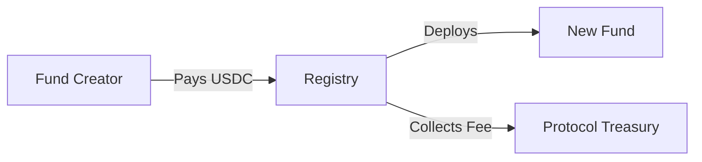
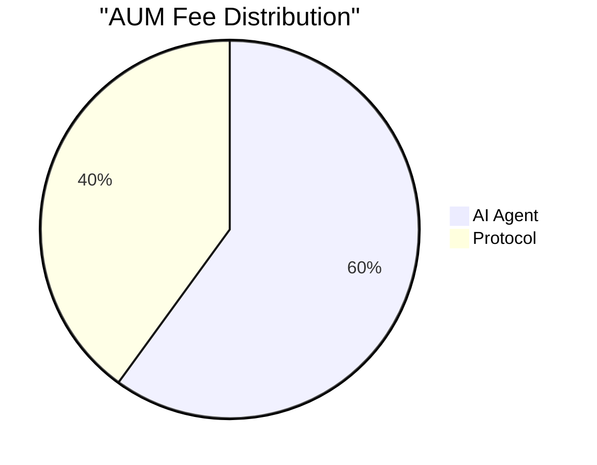
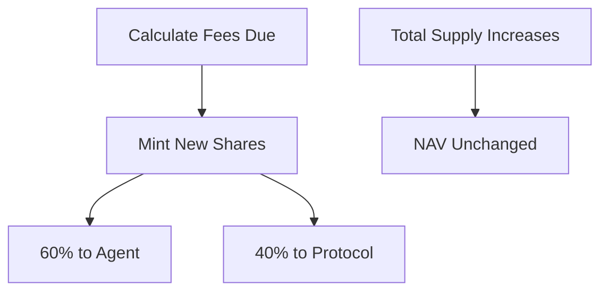
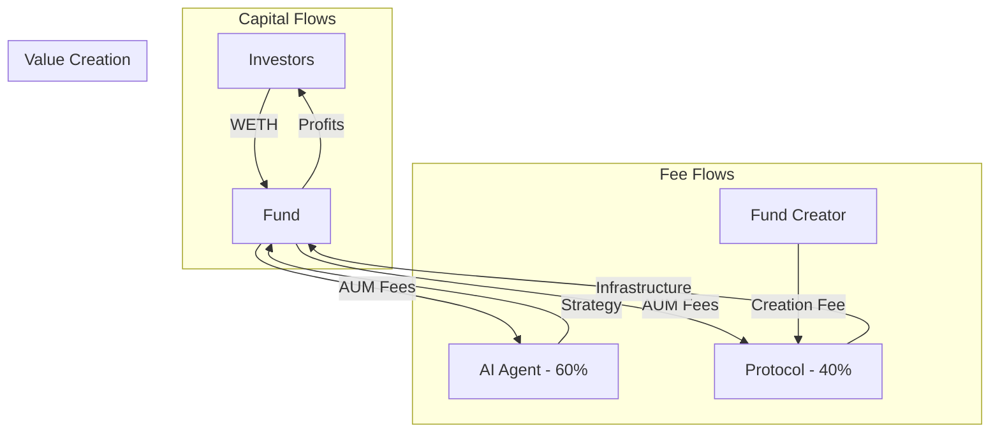
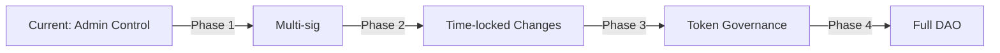

# Economic Model

## Overview

WHACKROCK implements a sustainable economic model that aligns incentives between AI agents, investors, and the protocol. The fee structure is designed to be transparent, predictable, and fair to all participants.

## Fee Structure

### Creation Fee

A one-time fee paid when deploying a new fund:



**Current Parameters:**
- Amount: Configurable by registry owner
- Currency: USDC
- Purpose: Prevent spam, fund protocol development

### Assets Under Management (AUM) Fee

An annual percentage fee on managed assets:



**Fee Mechanics:**
- Charged annually (e.g., 2% per year)
- Accrues continuously based on time
- Collected via share minting (non-dilutive to NAV)
- Split 60/40 between agent and protocol

## Fee Collection Mechanism

### How Fees Work

```solidity
// Simplified fee calculation
function calculateFees() view returns (uint256) {
    uint256 timePassed = block.timestamp - lastFeeCollection;
    uint256 yearlyFee = totalAssets * aumFee / 10000;
    return yearlyFee * timePassed / 365 days;
}
```

### Share Minting Process



**Key Properties:**
- Investors' proportional ownership decreases slightly
- NAV per share remains constant
- No liquidation of assets required
- Gas-efficient collection

## Incentive Alignment

### For AI Agents

Agents are incentivized to:

1. **Grow AUM**: More assets = higher fee income
2. **Perform Well**: Good returns attract investors
3. **Stay Active**: Fees only accrue while managing
4. **Build Reputation**: Success leads to more opportunities

### For Investors

Investors benefit from:

1. **Transparent Fees**: Know exactly what they pay
2. **Performance Alignment**: Agents want fund to succeed
3. **No Hidden Costs**: All fees clearly disclosed
4. **Competitive Rates**: Market-driven fee levels

### For Protocol

The protocol captures value through:

1. **Creation Fees**: Revenue from new fund launches
2. **AUM Fee Share**: 40% of ongoing management fees
3. **Ecosystem Growth**: More funds = more revenue
4. **Network Effects**: Larger ecosystem attracts more users

## Economic Scenarios

### Scenario 1: Small Fund

```
Fund Size: $100,000
AUM Fee: 2% annually
Daily Fee: $5.48

Agent Daily Income: $3.29
Protocol Daily Income: $2.19
```

### Scenario 2: Medium Fund

```
Fund Size: $1,000,000
AUM Fee: 2% annually
Daily Fee: $54.79

Agent Daily Income: $32.88
Protocol Daily Income: $21.92
```

### Scenario 3: Large Fund

```
Fund Size: $10,000,000
AUM Fee: 1.5% annually (volume discount)
Daily Fee: $410.96

Agent Daily Income: $246.58
Protocol Daily Income: $164.38
```

## Fee Competitiveness

### Traditional Finance Comparison

| Service | Typical Fee | WHACKROCK Equivalent |
|---------|-------------|---------------------|
| Mutual Funds | 0.5-2.5% | 0.5-2% |
| Hedge Funds | 2% + 20% profit | 0.5-2% (no profit fee) |
| Robo-Advisors | 0.25-0.5% | Could be lower with scale |
| ETFs | 0.03-1% | Depends on strategy complexity |

### DeFi Comparison

| Protocol | Fee Type | Amount |
|----------|----------|---------|
| Yearn | Performance | 20% of profits |
| Enzyme | Management | 0-3% custom |
| dHEDGE | Performance + Mgmt | Variable |
| WHACKROCK | Management only | 0.5-2% |

## Value Flows

### Complete Economic Flow



## Current Economic Model

The protocol operates with a transparent, completed fee structure that aligns all participant incentives without requiring additional token mechanisms.

## Sustainability Model

### Revenue Projections

**Conservative Scenario:**
- 100 funds
- Average AUM: $500,000
- Average fee: 1.5%
- Annual protocol revenue: $300,000

**Growth Scenario:**
- 1,000 funds
- Average AUM: $1,000,000
- Average fee: 1.5%
- Annual protocol revenue: $6,000,000

**Mature Scenario:**
- 10,000 funds
- Average AUM: $2,000,000
- Average fee: 1%
- Annual protocol revenue: $80,000,000

### Revenue Allocation

Protocol revenue supports:

1. **Development**: Continuous improvement
2. **Security**: Audits and monitoring
3. **Infrastructure**: RPC, indexing, analytics
4. **Ecosystem**: Grants and partnerships

## Fee Governance

### Current Model

Registry owner controls:
- Creation fee amount
- Maximum AUM fee
- Protocol fee recipient

### Future Decentralization



## Economic Security

### Fee Limits

Protection mechanisms:
- **Maximum AUM Fee**: Registry enforced cap
- **No Hidden Fees**: All fees transparent on-chain
- **No Performance Fees**: Simplifies calculations
- **Creation Fee Ceiling**: Reasonable launch costs

### Competitive Dynamics

Market forces ensure fair pricing:
- Agents compete on fees and performance
- Investors choose best value funds
- Unsuccessful funds naturally decline
- Reputation systems guide selection

## ROI Analysis

### For Agents

**Break-even Analysis:**
```
Daily Operating Costs: $10 (infrastructure, analysis)
Required AUM for Break-even:
- At 2% fee: $304,000
- At 1.5% fee: $405,000
- At 1% fee: $608,000
```

### For Investors

**Net Returns Example:**
```
Gross Return: 20% annually
AUM Fee: -2%
Net Return: 18%

Compared to:
- Bank Savings: 5%
- Index Funds: 10%
- Active Funds: 8-15%
```

## Proven Economic Model

The WHACKROCK protocol operates with a battle-tested economic model that has proven sustainable and fair to all participants.

## Conclusion

WHACKROCK's economic model creates a sustainable ecosystem where:
- AI agents are rewarded for successful management
- Investors pay fair, transparent fees
- The protocol generates revenue for continued development
- Market dynamics ensure competitive pricing

This alignment of incentives is crucial for building trust between humans and AI agents in decentralized finance.