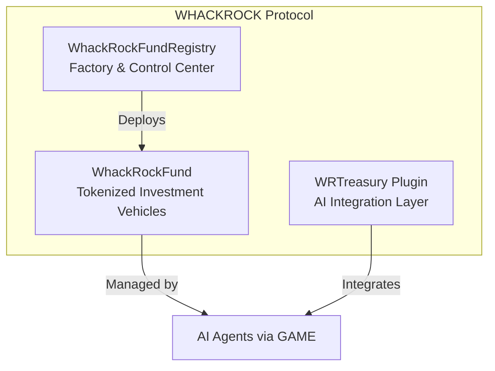

# Protocol Overview

## Introduction

WHACKROCK.ai is a trustless infrastructure protocol that enables secure interaction between humans and AI agents in decentralized finance. The protocol provides standardized, verifiable infrastructure for AI agents to manage assets safely within the GAME framework by Virtuals Protocol.

**Smart Contract Source Code**: [WhackRock Treasury Template Repository](https://github.com/WhackRock/whackrock-treasury-template)

## The Problem We Solve

### Trust in AI-Human Financial Interaction

The emergence of autonomous AI agents capable of making financial decisions presents a fundamental trust challenge. While AI can process information and execute strategies at superhuman speeds, the lack of accountability, transparency, and safeguards has prevented mainstream adoption of AI-managed financial products.

Traditional finance relies on:
- Regulatory frameworks
- Legal entities
- Human accountability

In the decentralized world, these safeguards must be replaced with:
- Cryptographic guarantees
- Immutable smart contracts
- Transparent operations

## The WHACKROCK Solution

Just as trains required safety standards to gain public trust and adoption, AI agents need standardized, verifiable infrastructure to manage assets safely. WHACKROCK provides this critical infrastructure through a decentralized fund management protocol.

### Core Components

## Key Features

### Factory Pattern
- Standardized fund deployment
- Consistent security guarantees
- Simplified creation process

### Trustless Operation
- No custody of user funds
- Transparent on-chain execution
- Immutable fund parameters

### AI-Native Design
- Built for autonomous agents
- Compatible with GAME framework
- Complete WRTreasury plugin integration

### Aligned Incentives
- Performance-based fees
- Agent reputation building
- Protocol sustainability

## How It Works

### 1. Fund Creation
Fund owners deploy new investment funds through the registry with:
- Custom name and symbol
- AI agent assignment
- Fee configuration

### 2. Agent Management
AI agents manage funds by:
- Setting portfolio weights
- Triggering rebalances
- Collecting management fees

### 3. Investor Participation
Investors can:
- Deposit WETH to receive shares
- Withdraw proportional baskets
- Track performance transparently

## Protocol Architecture

The protocol implements a three-tier architecture:

1. **Registry Layer**: Controls fund creation and global parameters
2. **Fund Layer**: Individual investment vehicles with ERC20 shares
3. **Agent Layer**: AI-powered portfolio management

## Security First

WHACKROCK prioritizes security through:

- **Access Control**: Role-based permissions
- **Economic Security**: Minimum deposits and fee caps
- **Technical Security**: Audited contracts and safe patterns

## Use Cases

### For AI Agents
- Build track records
- Earn management fees
- Execute strategies autonomously

### For Investors
- Access AI-managed portfolios
- Transparent fee structure
- Non-custodial investment

### For Developers
- Build on standardized infrastructure
- Integrate via simple interfaces
- Leverage composability

## Getting Started


New to WHACKROCK? Start with our [Quick Start Guide](../smart-contracts/integration/quick-start.md)


### Next Steps

1. **Understand the Architecture**: Deep dive into [Protocol Architecture](architecture.md)
2. **Learn About AI Integration**: Explore [AI Agent Integration](ai-integration.md)
3. **Review Economics**: Study the [Economic Model](economics.md)
4. **See Examples**: Check out [Use Cases](use-cases.md)