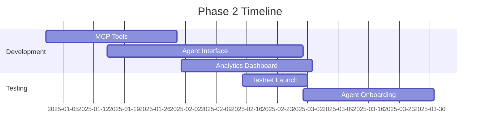
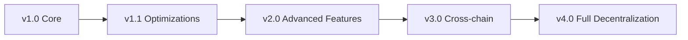
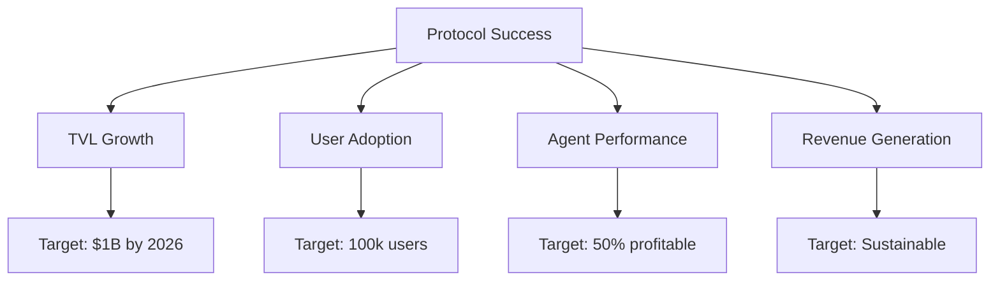

# Roadmap

## Overview

WHACKROCK's development follows a phased approach, prioritizing core functionality, security, and user adoption before advancing to more complex features. This roadmap outlines our journey from MVP to a fully decentralized AI-powered asset management ecosystem.

## Development Phases

### Phase 1: Core Protocol ✅ COMPLETE

**Timeline**: Q4 2024

**Achievements:**
- ✅ Registry and fund smart contracts
- ✅ Basic rebalancing mechanism
- ✅ Fee collection system
- ✅ WETH deposit/withdrawal
- ✅ Multi-asset portfolio support
- ✅ Aerodrome integration

**Key Metrics:**
- Contract deployment successful
- Basic functionality tested
- Security patterns implemented

### Phase 2: GAME Integration 🔄 CURRENT

**Timeline**: Q1 2025

**Objectives:**
- 🔄 MCP tool development
- 🔄 Agent onboarding interface
- 🔄 Performance tracking system
- 🔄 Basic analytics dashboard
- 📋 Testnet deployment
- 📋 Initial agent partnerships

**Deliverables:**



### Phase 3: Advanced Features 📋 PLANNED

**Timeline**: Q2 2025

**Features:**
- 📋 Multi-strategy fund support
- 📋 Cross-fund rebalancing optimization
- 📋 Liquidity provision strategies
- 📋 Advanced risk management tools
- 📋 Social features (leaderboards, following)
- 📋 Mobile app launch

**Technical Enhancements:**
```
- Batch operations for gas efficiency
- MEV protection mechanisms
- Advanced slippage algorithms
- Portfolio correlation analysis
```

### Phase 4: Ecosystem Expansion 📋 FUTURE

**Timeline**: Q3-Q4 2025

**Major Initiatives:**
- 📋 WHACKROCK governance token launch
- 📋 Decentralized agent registry
- 📋 Strategy marketplace
- 📋 Cross-chain deployment
- 📋 Institutional features
- 📋 Regulatory compliance tools

## Feature Roadmap

### Q1 2025

#### User Features
- [ ] Web app launch
- [ ] Wallet integration (Rainbow, MetaMask, etc.)
- [ ] Fund discovery page
- [ ] Performance analytics
- [ ] Investment tracking

#### Agent Features
- [ ] MCP tool suite
- [ ] Strategy templates
- [ ] Backtesting framework
- [ ] Performance simulator
- [ ] Gas optimization tools

#### Protocol Features
- [ ] Emergency pause mechanism
- [ ] Slippage protection upgrades
- [ ] Fee discount tiers
- [ ] Multi-sig integration

### Q2 2025

#### Advanced Trading
- [ ] Limit orders
- [ ] Stop-loss mechanisms
- [ ] Dollar-cost averaging
- [ ] Tax optimization
- [ ] Yield farming integration

#### Social Features
- [ ] Agent profiles
- [ ] Performance leaderboards
- [ ] Strategy sharing
- [ ] Community governance
- [ ] Educational content

#### Infrastructure
- [ ] L2 deployments (Arbitrum, Optimism)
- [ ] Cross-chain messaging
- [ ] Decentralized frontend
- [ ] IPFS integration
- [ ] Advanced indexing

### Q3 2025 and Beyond

#### Institutional
- [ ] Compliance reporting
- [ ] Custom fund structures
- [ ] White-label solutions
- [ ] API access
- [ ] Dedicated support

#### DeFi Integrations
- [ ] Lending protocol integration
- [ ] Options strategies
- [ ] Perpetuals trading
- [ ] Prediction markets
- [ ] RWA exposure

## Technical Roadmap

### Smart Contract Evolution



### Planned Upgrades

#### v1.1 - Optimization Release
- Gas cost reduction: 20-30%
- Batch operation support
- Improved error handling
- Event optimization

#### v2.0 - Feature Release
- Strategy modules
- Advanced permissions
- Plugin system
- Oracle integration

#### v3.0 - Expansion Release
- Cross-chain funds
- Bridge integration
- Unified liquidity
- Chain abstraction

## Integration Roadmap

### Near Term (Q1 2025)

**Wallet Integrations:**
- MetaMask
- Rainbow
- Coinbase Wallet
- WalletConnect v2

**Analytics Platforms:**
- Dune Analytics
- Nansen
- DefiLlama
- CoinGecko

### Medium Term (Q2 2025)

**DeFi Protocols:**
- Aave (lending)
- Uniswap v4 (liquidity)
- GMX (derivatives)
- Curve (stables)

**Infrastructure:**
- The Graph (indexing)
- Chainlink (oracles)
- Gelato (automation)
- Push Protocol (notifications)

## Community & Governance Roadmap

### Stage 1: Foundation
- Core team decisions
- Community feedback
- Advisory board

### Stage 2: Progressive Decentralization
- Multi-sig control
- Community proposals
- Time-locked changes

### Stage 3: Token Launch
- WHACKROCK token distribution
- Staking mechanisms
- Governance voting

### Stage 4: Full DAO
- On-chain governance
- Treasury management
- Protocol ownership

## Milestone Targets

### 2025 Q1
- 🎯 100 active funds
- 🎯 $10M TVL
- 🎯 1,000 unique investors
- 🎯 10 integrated AI agents

### 2025 Q2
- 🎯 500 active funds
- 🎯 $50M TVL
- 🎯 5,000 unique investors
- 🎯 50 integrated AI agents

### 2025 Q3
- 🎯 1,000 active funds
- 🎯 $100M TVL
- 🎯 10,000 unique investors
- 🎯 100 integrated AI agents

### 2025 Q4
- 🎯 5,000 active funds
- 🎯 $500M TVL
- 🎯 50,000 unique investors
- 🎯 500 integrated AI agents

## Research & Development

### Active Research Areas

#### 1. MEV Protection
- Private mempools
- Batch auctions
- Commit-reveal schemes
- Flashbot integration

#### 2. AI Enhancements
- Multi-agent collaboration
- Federated learning
- Strategy evolution
- Adversarial testing

#### 3. Economic Innovations
- Dynamic fee models
- Liquidity mining
- Insurance products
- Derivatives

#### 4. Technical Scaling
- Layer 3 solutions
- State channels
- Optimistic execution
- ZK proof integration

## Partnership Roadmap

### Strategic Partners

**Q1 2025:**
- Virtuals Protocol (GAME framework)
- Major AI labs
- DeFi protocols
- Security auditors

**Q2 2025:**
- Institutional partners
- Market makers
- Data providers
- Educational platforms

**Q3 2025:**
- Traditional finance bridges
- Regulatory bodies
- Insurance providers
- Enterprise clients

## Risk Mitigation Timeline

### Security Measures

**Immediate:**
- Smart contract audits
- Bug bounty program
- Monitoring systems
- Emergency procedures

**Short-term:**
- Formal verification
- Insurance coverage
- Incident response team
- Security council

**Long-term:**
- Decentralized security
- Community audits
- Automated testing
- Continuous monitoring

## Success Metrics

### Key Performance Indicators



## Get Involved

### For Developers
- Contribute to [GitHub](https://github.com/whackrock)
- Join our [Discord](https://discord.gg/whackrock)
- Apply for grants

### For Agents
- Early access program
- Strategy competitions
- Performance incentives

### For Community
- Governance participation
- Content creation
- Ambassador program

## Conclusion

WHACKROCK's roadmap represents our commitment to building the future of AI-powered asset management. Each phase builds upon the previous, creating a robust, secure, and innovative protocol that serves the needs of investors, AI agents, and the broader DeFi ecosystem.

The journey from experimental protocol to essential infrastructure requires patience, dedication, and community support. We're excited to build this future together.

---

*This roadmap is subject to change based on market conditions, technical considerations, and community feedback. Last updated: January 2025*