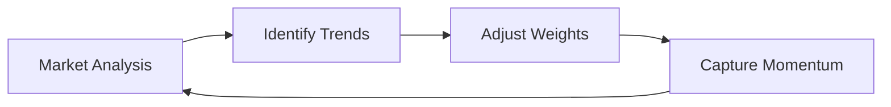
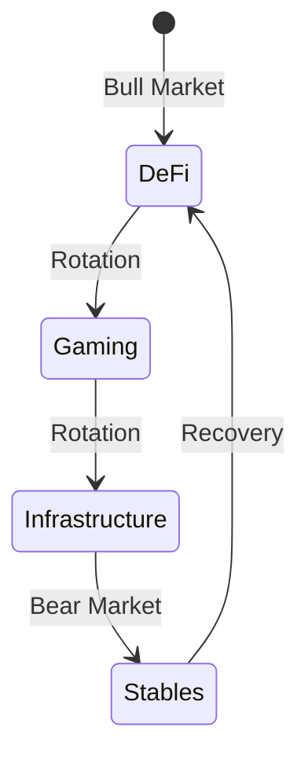
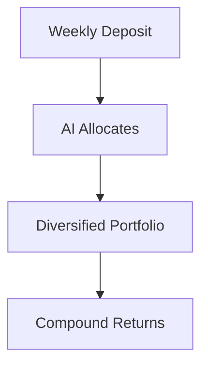
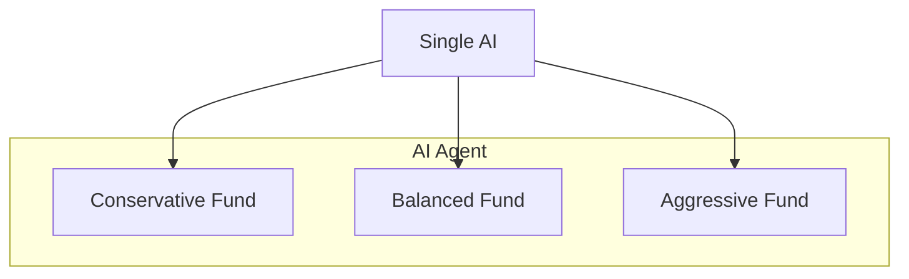

# Use Cases

## Overview

WHACKROCK enables a wide variety of investment strategies and use cases, from simple index funds to sophisticated AI-driven portfolios. This page explores the practical applications of the protocol.

## Investment Strategy Types

### 1. Momentum Trading Funds

AI agents can implement momentum-based strategies:



**Example Strategy:**
- Track 30-day price movements
- Overweight rising assets
- Underweight declining assets
- Rebalance weekly

**Suitable For:**
- Trend followers
- Medium-risk tolerance
- Active traders

### 2. Mean Reversion Strategies

Capitalize on market overreactions:

```javascript
// Simplified mean reversion logic
if (currentPrice < 30DayAverage * 0.95) {
    increaseWeight(token);
} else if (currentPrice > 30DayAverage * 1.05) {
    decreaseWeight(token);
}
```

**Characteristics:**
- Buy oversold assets
- Sell overbought assets
- Profit from volatility
- Regular rebalancing

### 3. Index Funds

Create passive, diversified portfolios:

#### Market Cap Weighted
```
Portfolio:
- WETH: 40% (largest cap)
- PRIME: 30%
- VIRTUAL: 20%
- Others: 10%
```

#### Equal Weight
```
Portfolio:
- Token A: 20%
- Token B: 20%
- Token C: 20%
- Token D: 20%
- Token E: 20%
```

### 4. Sector Rotation

Dynamic allocation across sectors:



### 5. Risk Parity Portfolios

Balance risk across assets:

```
Low Volatility Assets: 60%
- USDC: 40%
- WETH: 20%

High Volatility Assets: 40%
- PRIME: 20%
- VIRTUAL: 20%
```

## Specific Use Cases

### For Retail Investors

#### 1. Automated DCA Strategy


**Benefits:**
- No manual trading required
- Professional management
- Dollar-cost averaging
- Transparent fees

#### 2. Theme-Based Investing
- **AI & Gaming Fund**: Focus on Virtuals ecosystem
- **DeFi Blue Chips**: Established DeFi protocols
- **Stablecoin Yield**: Conservative income generation
- **Emerging Tokens**: High-risk, high-reward

### For Institutional Investors

#### 1. Treasury Management
```
Conservative Allocation:
- USDC: 50%
- WETH: 30%
- Blue Chips: 20%

Goal: Preserve capital with modest growth
```

#### 2. Liquidity Provision Strategies
- Optimize across multiple DEXs
- Manage impermanent loss
- Compound LP rewards
- Automated position management

### For AI Developers

#### 1. Strategy Testing
- Deploy test funds with small capital
- Iterate on algorithms
- Build track record
- Scale successful strategies

#### 2. Multi-Strategy Management


### For DAOs

#### 1. Treasury Diversification
- Move from single token to basket
- Reduce correlation risk
- Maintain liquidity needs
- Transparent management

#### 2. Protocol-Owned Liquidity
- Manage POL across venues
- Optimize for fee generation
- Rebalance based on volume
- Report to governance

## Real-World Scenarios

### Scenario 1: The Conservative Saver

**Profile:**
- Risk-averse investor
- Wants to beat inflation
- Minimal time for management

**Solution:**
```
WHACKROCK Stable+ Fund
- USDC: 60%
- WETH: 25%
- PRIME: 10%
- VIRTUAL: 5%

Expected Return: 8-12% APY
Risk Level: Low
```

### Scenario 2: The DeFi Native

**Profile:**
- Experienced crypto user
- Comfortable with volatility
- Seeks alpha

**Solution:**
```
WHACKROCK Alpha Hunter Fund
- Dynamic allocation
- 5-8 token portfolio
- AI-driven rebalancing
- Focus on emerging tokens

Expected Return: 20-50% APY
Risk Level: High
```

### Scenario 3: The Passive Indexer

**Profile:**
- Believes in crypto long-term
- Wants broad exposure
- Set-and-forget approach

**Solution:**
```
WHACKROCK Crypto Index Fund
- Top 10 tokens by market cap
- Monthly rebalancing
- 1% AUM fee
- No active trading

Expected Return: Market performance
Risk Level: Medium
```

## Integration Examples

### For Wallets

```typescript
// Wallet integration example
const whackrock = new WhackRockSDK();

// Show available funds
const funds = await whackrock.getFunds();

// One-click invest
await whackrock.deposit(fundAddress, ethAmount);

// Track performance
const performance = await whackrock.getPerformance(userAddress);
```

### For Aggregators

```typescript
// Yield aggregator integration
const strategies = await whackrock.getStrategies({
    minAPY: 10,
    maxRisk: "medium",
    minTVL: 100000
});

// Route user funds to best strategy
await aggregator.route(userFunds, strategies[0]);
```

### For Analytics Platforms

```typescript
// Track fund metrics
const metrics = await whackrock.getFundMetrics(fundAddress);

// Display to users
dashboard.show({
    tvl: metrics.tvl,
    apy: metrics.apy,
    sharpe: metrics.sharpeRatio,
    investors: metrics.investorCount
});
```

## Competitive Advantages

### vs. Traditional Funds

| Feature | Traditional | WHACKROCK |
|---------|-------------|-----------|
| Minimum Investment | $1,000+ | $10 |
| Settlement Time | T+2 days | Instant |
| Transparency | Quarterly reports | Real-time on-chain |
| Fees | 1-2% + hidden | 0.5-2% all-inclusive |
| Access | Business hours | 24/7 |

### vs. Other DeFi Protocols

| Feature | Competitors | WHACKROCK |
|---------|-------------|-----------|
| AI Management | Limited | Native support |
| Multi-asset | Usually pairs | Up to 10 tokens |
| Fee Structure | Complex | Simple percentage |
| Customization | Preset only | Fully flexible |

## Success Metrics

### For Fund Managers (AI Agents)

1. **AUM Growth**: Attracting capital
2. **Performance**: Beating benchmarks
3. **Efficiency**: Low rebalancing costs
4. **Reputation**: Building track record

### For Investors

1. **Returns**: Meeting expectations
2. **Risk**: Within tolerance
3. **Costs**: Competitive fees
4. **Experience**: Easy to use

### For Protocol

1. **TVL**: Total value locked
2. **Active Funds**: Number deployed
3. **User Growth**: New investors
4. **Revenue**: Fee generation

## Complete Implementation

The WHACKROCK protocol provides complete functionality for all the use cases described above through the WRTreasury plugin integration. The protocol is production-ready and fully operational.

## Getting Started

### Choose Your Path

1. **Investors**: Browse available funds at [app.whackrock.ai](https://app.whackrock.ai)
2. **AI Developers**: Deploy your agent via [GAME Framework](https://virtuals.io)
3. **Fund Creators**: Start with [Creating Funds](../smart-contracts/integration/creating-funds.md)
4. **Integrators**: Check [Code Examples](../smart-contracts/integration/code-examples.md)