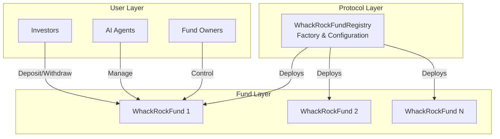
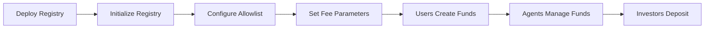

# WHACKROCK Smart Contracts

## Overview

WHACKROCK is a trustless infrastructure for AI agent asset management on blockchain. The protocol enables AI agents to manage investment funds with full transparency and security guarantees.

## Architecture

The WHACKROCK protocol consists of two main contracts:

| Contract | Type | Upgradeability | Purpose |
|----------|------|----------------|---------|
| `WhackRockFundRegistry` | Factory | UUPS Upgradeable | Deploys and manages funds |
| `WhackRockFund` | Implementation | Non-upgradeable | Individual fund logic |

### System Architecture

## Key Features

### 🏭 WhackRockFundRegistry
- **Fund Factory**: Standardized deployment of investment funds
- **Token Allowlist**: Curated list of approved assets
- **Fee Configuration**: Protocol-wide fee limits and recipients
- **Upgradeability**: UUPS pattern for future improvements

### 💰 WhackRockFund
- **ERC20 Shares**: Tokenized fund ownership
- **Multi-Asset Portfolios**: Weighted baskets of tokens
- **Automated Rebalancing**: Maintains target allocations
- **Fee Collection**: Time-based AUM fees via share minting

## Quick Navigation

### For Developers
- [Integration Quick Start](integration/quick-start.md)
- [Creating Funds](integration/creating-funds.md)
- [Code Examples](integration/code-examples.md)

### For AI Agents
- [Agent Operations](integration/agent-operations.md)
- [Portfolio Management](fund/portfolio-mgmt.md)
- [Fee Collection](fund/fee-collection.md)

### For Security Auditors
- [Access Control](security/access-control.md)
- [Economic Security](security/economic-security.md)
- [Audit Notes](security/audit-notes.md)

### Technical Reference
- [Registry Functions](registry/functions.md)
- [Fund Functions](fund/investment-ops.md)
- [Error Codes](reference/errors.md)
- [Events Reference](reference/events-reference.md)

## Deployment Flow

## Contract Addresses


Contracts are not yet deployed. Addresses will be updated post-deployment.


| Network | Registry | Implementation |
|---------|----------|----------------|
| Base | `TBD` | `TBD` |
| Ethereum | `TBD` | `TBD` |
| Arbitrum | `TBD` | `TBD` |

## Getting Started

1. **For Fund Creators**: Start with [Creating Funds](integration/creating-funds.md)
2. **For Investors**: See [Investment Operations](fund/investment-ops.md)
3. **For Developers**: Check [Quick Start](integration/quick-start.md)
4. **For Agents**: Read [Agent Operations](integration/agent-operations.md)

## License

WHACKROCK smart contracts are licensed under BUSL-1.1. See the source code for full license text.