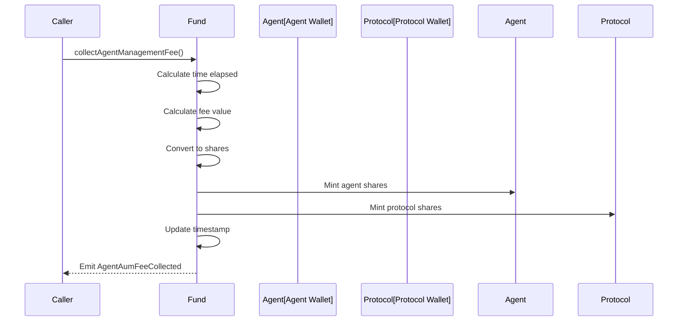

# Fee Collection

## Overview

WhackRockFund implements a time-based AUM (Assets Under Management) fee system. Fees are collected by minting new shares to fee recipients, which is non-dilutive to the fund's Net Asset Value per share.

## Fee Structure

### Annual AUM Fee
- Set at fund creation (immutable)
- Expressed in basis points
- Typical range: 50-500 BPS (0.5%-5%)
- Accrues continuously over time

### Fee Distribution Split
- **Agent**: 60% (`AGENT_AUM_FEE_SHARE_BPS = 6000`)
- **Protocol**: 40% (`PROTOCOL_AUM_FEE_SHARE_BPS = 4000`)

## Fee Collection Function

### collectAgentManagementFee()

```solidity
function collectAgentManagementFee() external
```

**Purpose**: Calculates accrued fees and mints shares to fee recipients

**Access**: Public (anyone can trigger)

**Requirements**:
- AUM fee rate > 0
- Time has passed since last collection
- Fund has positive NAV and shares

**Process Flow**:



## Fee Calculation Formula

### Time-Based Accrual

```solidity
timeElapsed = block.timestamp - lastAgentAumFeeCollectionTimestamp
totalFeeValueInAA = (navAtFeeCalc * agentAumFeeBps * timeElapsed) / (TOTAL_WEIGHT_BASIS_POINTS * 365 days)
```

### Share Conversion

```solidity
totalSharesToMintForFee = (totalFeeValueInAA * sharesAtFeeCalc) / navAtFeeCalc
```

### Split Distribution

```solidity
agentShares = (totalSharesToMintForFee * AGENT_AUM_FEE_SHARE_BPS) / TOTAL_WEIGHT_BASIS_POINTS
protocolShares = totalSharesToMintForFee - agentShares
```

## Example Calculation

### Scenario
- Fund NAV: 1000 WETH
- Total Shares: 500
- AUM Fee: 200 BPS (2% annual)
- Days Elapsed: 30 days

### Step-by-Step

1. **Fee Value**:
   ```
   feeValue = (1000 * 200 * 30 days) / (10000 * 365 days)
           = 6,000,000 / 3,650,000
           = 1.64 WETH
   ```

2. **Shares to Mint**:
   ```
   sharesToMint = (1.64 * 500) / 1000
                = 0.82 shares
   ```

3. **Distribution**:
   ```
   agentShares = 0.82 * 0.6 = 0.492 shares
   protocolShares = 0.82 * 0.4 = 0.328 shares
   ```

4. **Result**:
   - Total shares become: 500.82
   - NAV per share unchanged: 1000/500.82 ≈ 1.998 WETH

## Non-Dilutive Nature

### Why Fees Don't Dilute NAV per Share

The fee mechanism maintains constant NAV per share:

**Before Fee Collection**:
- NAV: 1000 WETH
- Shares: 500
- Price per share: 2.0 WETH

**After Fee Collection**:
- NAV: 1000 WETH (unchanged)
- Shares: 500.82 (increased)
- Price per share: 1000/500.82 ≈ 1.998 WETH

The small decrease (0.002 WETH) represents the exact fee amount distributed to fee recipients.

## Fee Collection Timing

### Frequency Considerations

| Collection Frequency | Advantages | Disadvantages |
|---------------------|------------|---------------|
| Daily | Accurate accrual | High gas costs |
| Weekly | Good balance | Some accrual error |
| Monthly | Low gas costs | Larger accrual error |
| On-demand | Flexible | Unpredictable |

### Optimal Strategy

Most agents collect fees:
- Before major strategy changes
- Monthly or quarterly
- When gas prices are low
- Before reporting periods

## Events

### AgentAumFeeCollected

```solidity
event AgentAumFeeCollected(
    address indexed agentFeeWallet,
    uint256 agentSharesMinted,
    address indexed protocolFeeRecipient,
    uint256 protocolSharesMinted,
    uint256 totalFeeValueInAccountingAsset,
    uint256 navAtFeeCalculation,
    uint256 totalSharesAtFeeCalculation,
    uint256 timestamp
)
```

**Use Cases**:
- Track fee collection history
- Calculate effective fee rates
- Monitor agent performance
- Audit fee distribution

## Implementation Details

### Edge Cases

#### Zero AUM Fee
```solidity
if (agentAumFeeBps == 0) revert E5();
```
No fee collection if rate is zero.

#### No Time Elapsed
```solidity
if (block.timestamp <= lastAgentAumFeeCollectionTimestamp) revert E5();
```
Prevents double collection in same block.

#### Zero NAV or Shares
```solidity
if (navAtFeeCalc == 0 || sharesAtFeeCalc == 0) {
    lastAgentAumFeeCollectionTimestamp = block.timestamp;
    return;
}
```
Updates timestamp but doesn't mint shares.

### Precision Considerations

The fee calculation uses integer arithmetic:
- Small time periods may result in zero fees
- Dust amounts are handled gracefully
- Cumulative rounding errors are minimal

## Agent Integration

### Manual Collection

```javascript
// Collect fees manually
const tx = await fund.collectAgentManagementFee();
await tx.wait();

// Check minted shares from event
const receipt = await tx.wait();
const event = receipt.logs.find(log => 
    log.eventName === 'AgentAumFeeCollected'
);
console.log('Agent shares:', event.args.agentSharesMinted);
```

### Automated Collection

```javascript
class FeeCollector {
    constructor(fund, minInterval = 7 * 24 * 3600) { // 7 days
        this.fund = fund;
        this.minInterval = minInterval;
    }
    
    async shouldCollectFees() {
        const lastCollection = await this.fund.lastAgentAumFeeCollectionTimestamp();
        const elapsed = Date.now() / 1000 - lastCollection;
        return elapsed >= this.minInterval;
    }
    
    async collectIfReady() {
        if (await this.shouldCollectFees()) {
            return await this.fund.collectAgentManagementFee();
        }
    }
}
```

## Fee Performance Analysis

### Calculating Effective Fee Rate

```javascript
async function calculateEffectiveFeeRate(fund, startTime, endTime) {
    // Get fee collection events
    const filter = fund.filters.AgentAumFeeCollected();
    const events = await fund.queryFilter(filter, startTime, endTime);
    
    // Sum total fees in period
    const totalFees = events.reduce((sum, event) => 
        sum + event.args.totalFeeValueInAccountingAsset, 0n
    );
    
    // Get average NAV
    const avgNAV = await calculateAverageNAV(fund, startTime, endTime);
    const timeElapsed = endTime - startTime;
    const annualSeconds = 365 * 24 * 3600;
    
    // Calculate annualized rate
    const effectiveRate = (totalFees * annualSeconds) / (avgNAV * timeElapsed);
    return Number(effectiveRate * 10000n) / 10000; // Convert to BPS
}
```

### Fee Revenue Tracking

```javascript
class FeeTracker {
    async getAgentRevenue(agentWallet, fund) {
        const events = await fund.queryFilter(
            fund.filters.AgentAumFeeCollected(agentWallet)
        );
        
        let totalShares = 0n;
        let totalValue = 0n;
        
        for (const event of events) {
            totalShares += event.args.agentSharesMinted;
            totalValue += event.args.totalFeeValueInAccountingAsset * 60n / 100n; // 60%
        }
        
        return { totalShares, totalValue };
    }
}
```

## Security Considerations

### Access Control
- Fee collection is public (anyone can trigger)
- Fee rates and recipients are immutable
- Only collection timing is controllable

### Economic Security
- Non-dilutive mechanism prevents value extraction
- Time-based accrual prevents gaming
- Maximum fee rates enforced by registry

### Gas Optimization
- Minimal storage updates
- Efficient share minting
- Event emission for tracking

## Best Practices

### For Agents

1. **Regular Collection**: Don't let fees accumulate too long
2. **Gas Efficiency**: Collect during low-cost periods
3. **Timing Strategy**: Collect before major changes
4. **Revenue Tracking**: Monitor fee income vs performance

### For Integrators

1. **Event Monitoring**: Track fee collections for analysis
2. **User Disclosure**: Show fee impact to investors
3. **Performance Metrics**: Include fee-adjusted returns
4. **Gas Estimation**: Factor in collection costs

### For Investors

1. **Fee Awareness**: Understand fee structure before investing
2. **Performance Tracking**: Monitor net returns after fees
3. **Agent Comparison**: Compare fee rates across funds
4. **Long-term Impact**: Consider compounding effect of fees

## Common Patterns

### Fee Collection Bot

```javascript
class FeeBot {
    async run() {
        const funds = await this.getFundList();
        
        for (const fund of funds) {
            try {
                const shouldCollect = await this.shouldCollectFees(fund);
                if (shouldCollect) {
                    await fund.collectAgentManagementFee();
                    console.log(`Collected fees for ${fund.address}`);
                }
            } catch (error) {
                console.error(`Fee collection failed for ${fund.address}:`, error);
            }
        }
    }
}
```

### Gas Price Optimization

```javascript
async function collectFeesWhenCheap(fund, maxGasPrice) {
    const gasPrice = await provider.getGasPrice();
    
    if (gasPrice <= maxGasPrice) {
        return await fund.collectAgentManagementFee();
    } else {
        console.log(`Gas too expensive: ${gasPrice} > ${maxGasPrice}`);
        return null;
    }
}
```

## Related Documentation

- [Investment Operations](investment-ops.md) - How fees affect share calculations
- [Portfolio Management](portfolio-mgmt.md) - Fee collection timing strategies
- [Events](events.md) - Detailed event documentation