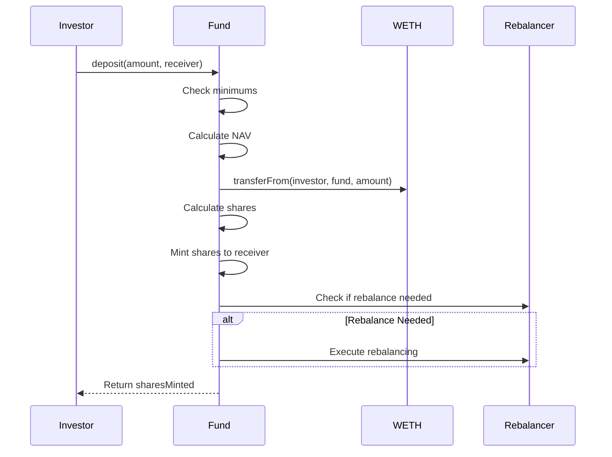
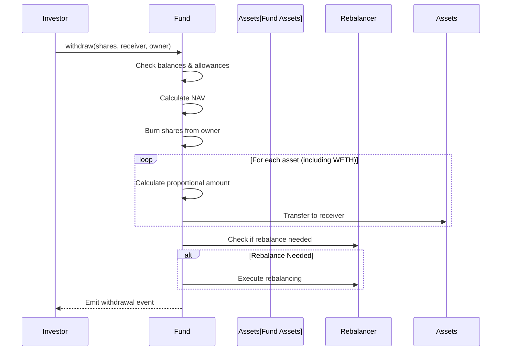

# Investment Operations

## Overview

This guide covers the core investment operations of WhackRockFund: deposits and withdrawals. These functions handle the minting and burning of fund shares while maintaining portfolio balance.

**Smart Contract Reference**: [WhackRock Treasury Template Repository](https://github.com/WhackRock/whackrock-treasury-template) - `src/funds/WhackRockFundV6_UniSwap_TWAP.sol`

## Deposit Function

### Function Signature

```solidity
function deposit(
    uint256 amountWETHToDeposit, 
    address receiver
) external returns (uint256 sharesMinted)
```

### Purpose
Allows investors to deposit WETH and receive fund shares proportional to their investment.

### Parameters
- `amountWETHToDeposit`: Amount of WETH to invest
- `receiver`: Address that will receive the minted shares

### Requirements
- Minimum deposit: 0.01 WETH
- First deposit minimum: 0.01 WETH
- Receiver cannot be zero address
- Caller must have approved WETH transfer

### Process Flow



### Share Calculation

#### First Deposit
```solidity
if (totalSupply() == 0) {
    sharesMinted = amountWETHToDeposit;
    // With minimum safeguard
    if (sharesMinted < MINIMUM_SHARES_LIQUIDITY) {
        sharesMinted = MINIMUM_SHARES_LIQUIDITY;
    }
}
```

#### Subsequent Deposits
```solidity
sharesMinted = (amountWETHToDeposit * totalSupply()) / navBeforeDeposit;
```

### Example Usage

```javascript
// 1. Approve WETH spending
await WETH.approve(fundAddress, ethers.parseEther("1.0"));

// 2. Deposit 1 WETH
const tx = await fund.deposit(
    ethers.parseEther("1.0"),  // 1 WETH
    investorAddress            // Receive shares
);

// 3. Get shares minted from event
const receipt = await tx.wait();
const event = receipt.logs.find(log => 
    log.eventName === 'WETHDepositedAndSharesMinted'
);
console.log('Shares received:', event.args.sharesMinted);
```

### Events Emitted

```solidity
event WETHDepositedAndSharesMinted(
    address indexed depositor,
    address indexed receiver,
    uint256 wethDeposited,
    uint256 sharesMinted,
    uint256 navBeforeDepositWETH,
    uint256 totalSupplyBeforeDeposit,
    uint256 wethValueInUSDC
);

event RebalanceCheck(
    bool needsRebalance,
    uint256 maxDeviationBPS,
    uint256 currentNAV_AA
);
```

## Withdraw Function

### Function Signature

```solidity
function withdraw(
    uint256 sharesToBurn, 
    address receiver, 
    address owner
) external
```

### Purpose
Burns fund shares and returns a proportional basket of all fund assets to the investor.

### Parameters
- `sharesToBurn`: Number of shares to redeem
- `receiver`: Address that will receive the assets
- `owner`: Address that owns the shares

### Requirements
- Non-zero shares to burn
- Valid receiver and owner addresses
- Owner must have sufficient shares
- If caller ≠ owner, must have allowance

### Process Flow



### Withdrawal Calculation

For each asset in the fund:
```solidity
amountToWithdraw = (assetBalance * sharesToBurn) / totalSupplyBeforeWithdrawal
```

### Example Usage

```javascript
// 1. Direct withdrawal (owner calling)
await fund.withdraw(
    ethers.parseEther("100"),  // Burn 100 shares
    investorAddress,           // Receive assets
    investorAddress           // Owner of shares
);

// 2. Withdrawal with approval (third party calling)
// First: Owner approves
await fund.approve(helperAddress, ethers.parseEther("100"));

// Then: Helper executes withdrawal
await fund.connect(helper).withdraw(
    ethers.parseEther("100"),
    investorAddress,    // Assets still go to investor
    investorAddress     // Owner of shares
);
```

### Important Considerations


**Basket Withdrawal**: Withdrawals return all fund assets proportionally, not just WETH. Ensure your wallet can handle multiple tokens.


### Events Emitted

```solidity
event BasketAssetsWithdrawn(
    address indexed owner,
    address indexed receiver,
    uint256 sharesBurned,
    address[] tokensWithdrawn,
    uint256[] amountsWithdrawn,
    uint256 navBeforeWithdrawalWETH,
    uint256 totalSupplyBeforeWithdrawal,
    uint256 totalWETHValueOfWithdrawal,
    uint256 wethValueInUSDC
);
```

## Rebalancing Triggers

Both deposit and withdraw operations check if rebalancing is needed:

1. **After Deposit**: New WETH needs allocation to target tokens
2. **After Withdrawal**: Proportional withdrawal may skew allocations
3. **First Deposit**: Always triggers initial allocation

Rebalancing occurs when:
```solidity
deviationBPS > REBALANCE_DEVIATION_THRESHOLD_BPS || isFirstDeposit
```

## NAV Calculations

### totalNAVInAccountingAsset()

```solidity
function totalNAVInAccountingAsset() public view returns (uint256)
```

Calculates total fund value in WETH:
1. Sum all token balances converted to WETH
2. Add WETH balance
3. Return total

### totalNAVInUSDC()

```solidity
function totalNAVInUSDC() public view returns (uint256)
```

Converts WETH NAV to USD value for reporting.

## Security Features

### Deposit Security
- **Minimum Amount**: Prevents dust attacks
- **Share Calculation**: Prevents dilution attacks
- **Reentrancy Protection**: Via checks-effects-interactions

### Withdrawal Security
- **Authorization**: Proper allowance checks
- **Balance Verification**: Cannot withdraw more than owned
- **Asset Validation**: All transfers use SafeERC20

## Gas Optimization Tips

### For Deposits
1. **Batch Deposits**: Multiple users can coordinate
2. **Avoid Small Amounts**: Gas cost vs deposit ratio
3. **Pre-check Rebalancing**: View function to predict gas

### For Withdrawals  
1. **Full Withdrawal**: More gas efficient than partial
2. **Claim All Assets**: Have wallet ready for multiple tokens
3. **Time After Rebalancing**: Avoids triggering new rebalance

## Common Integration Patterns

### Deposit Helper Contract
```solidity
contract DepositHelper {
    function depositETH(address fund) external payable {
        // Convert ETH to WETH
        IWETH(WETH).deposit{value: msg.value}();
        
        // Approve fund
        IERC20(WETH).approve(fund, msg.value);
        
        // Deposit and forward shares
        uint256 shares = IWhackRockFund(fund).deposit(
            msg.value, 
            msg.sender
        );
    }
}
```

### Withdrawal Aggregator
```solidity
contract WithdrawalAggregator {
    function withdrawAndSwapToWETH(
        address fund,
        uint256 shares,
        address[] calldata tokensToSwap
    ) external {
        // Withdraw basket
        IWhackRockFund(fund).withdraw(shares, address(this), msg.sender);
        
        // Swap all tokens back to WETH
        for (uint i = 0; i < tokensToSwap.length; i++) {
            _swapToWETH(tokensToSwap[i]);
        }
        
        // Send WETH to user
        IERC20(WETH).transfer(msg.sender, IERC20(WETH).balanceOf(address(this)));
    }
}
```

## Troubleshooting

### Common Deposit Issues
1. **"E2" Error**: Amount below minimum
2. **"ERC20: insufficient allowance"**: Approve WETH first
3. **Revert on transfer**: Check WETH balance

### Common Withdrawal Issues
1. **"E3" Error**: Insufficient shares
2. **"ERC20InsufficientAllowance"**: Need approval for third-party
3. **Gas limit**: Withdrawing many tokens costs more gas

## Related Documentation

- [Portfolio Management](portfolio-mgmt.md) - Rebalancing details
- [Fee Collection](fee-collection.md) - How fees affect shares
- [Events](events.md) - Full event documentation