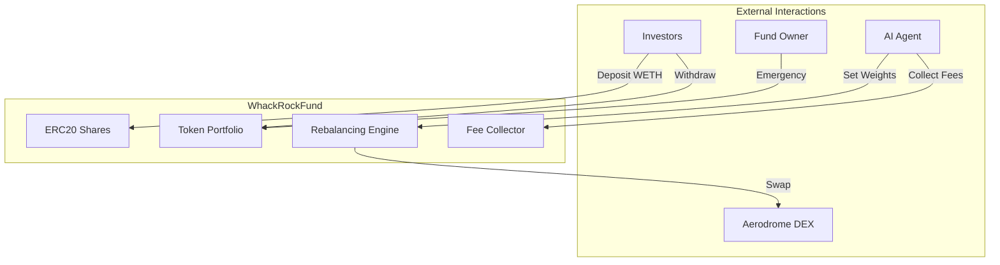

# WhackRockFund Overview

## Introduction

WhackRockFund is the core investment vehicle of the WHACKROCK protocol. Each fund is an independent smart contract that implements a tokenized, multi-asset portfolio managed by an AI agent or human operator.

## Key Features

### 🪙 ERC20 Tokenized Shares
- Fully compliant ERC20 tokens represent fund ownership
- Shares are minted on deposit and burned on withdrawal
- Standard token functionality enables DeFi composability

### 📊 Multi-Asset Portfolios
- Support for multiple ERC20 tokens
- Configurable target weights for each asset
- Automated portfolio management

### ⚖️ Automated Rebalancing
- Maintains target allocations within deviation thresholds
- Triggered automatically on deposits/withdrawals
- Manual rebalancing available to agents

### 💰 Fee Collection
- Time-based AUM fees collected via share minting
- 60/40 split between agent and protocol
- Non-dilutive to NAV per share

## Contract Details

- **License**: BUSL-1.1
- **Solidity Version**: ^0.8.20
- **Upgradeability**: Non-upgradeable (immutable)
- **Dependencies**: OpenZeppelin Contracts v5.0+

## Inheritance Structure

```solidity
contract WhackRockFund is 
    IWhackRockFund,    // Interface implementation
    ERC20,             // Token functionality
    Ownable            // Access control
```

## Design Philosophy

### 1. Security First
- Non-upgradeable for investor protection
- Minimum deposit requirements prevent attacks
- Emergency functions for owner intervention

### 2. Gas Efficiency
- Custom errors reduce deployment costs
- Optimized storage patterns
- Batch operations where possible

### 3. User Experience
- Simple WETH-only deposits
- Proportional withdrawals in all assets
- Transparent fee structure

### 4. Agent Flexibility
- Adjustable portfolio weights
- Manual rebalancing triggers
- Performance-based fee collection

## Core Concepts

### Net Asset Value (NAV)
The fund continuously calculates its total value in WETH (accounting asset):
- Sum of all token balances converted to WETH value
- Used for share price calculations
- Reported in both WETH and USDC terms

### Share Price Mechanism
- Initial shares: 1:1 with WETH deposited
- Subsequent shares: `deposit * totalShares / NAV`
- Ensures fair value for all investors

### Rebalancing Logic
1. Calculate current vs target allocations
2. Identify tokens to buy/sell
3. Execute swaps via Aerodrome DEX
4. Maintain slippage protection

### Fee Accrual
- Fees accrue continuously over time
- Collection mints new shares to fee recipients
- Formula: `(NAV × feeRate × timeElapsed) / (365 days × 10000)`

## Integration Architecture



## Lifecycle Example

1. **Creation**: Registry deploys fund with initial parameters
2. **First Deposit**: Investor deposits WETH, receives shares
3. **Rebalancing**: Automatic swap to target allocations
4. **Management**: Agent adjusts weights based on strategy
5. **Fee Collection**: Periodic minting of fee shares
6. **Withdrawal**: Investor burns shares, receives asset basket

## Key Differences from Traditional Funds

| Feature | Traditional Fund | WhackRockFund |
|---------|-----------------|----------------|
| Custody | Centralized | Smart Contract |
| Transparency | Limited | Full On-chain |
| Access | Restricted | Permissionless |
| Fees | Hidden/Complex | Transparent |
| Settlement | T+2 Days | Instant |
| Minimum Investment | High | 0.01 ETH |

## Security Considerations

### Economic Security
- Minimum deposits prevent share price manipulation
- Slippage limits protect against sandwich attacks
- Fee caps prevent excessive extraction

### Access Control
- Owner can change agents and emergency withdraw
- Agents can only manage portfolio and collect fees
- Public can only deposit and withdraw

### Technical Security
- No external calls in critical paths
- SafeERC20 for all token transfers
- Comprehensive error handling

## Next Steps

- [Constants](constants.md) - Configuration parameters
- [State Variables](state-variables.md) - Contract storage
- [Investment Operations](investment-ops.md) - Deposit/withdraw guide
- [Portfolio Management](portfolio-mgmt.md) - Rebalancing details