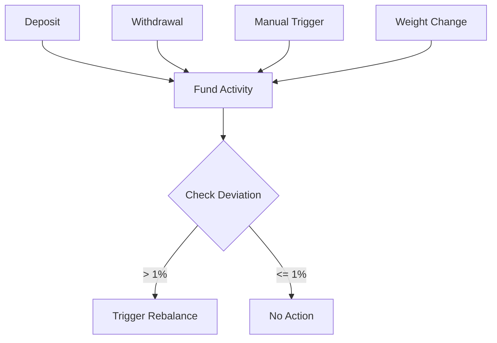
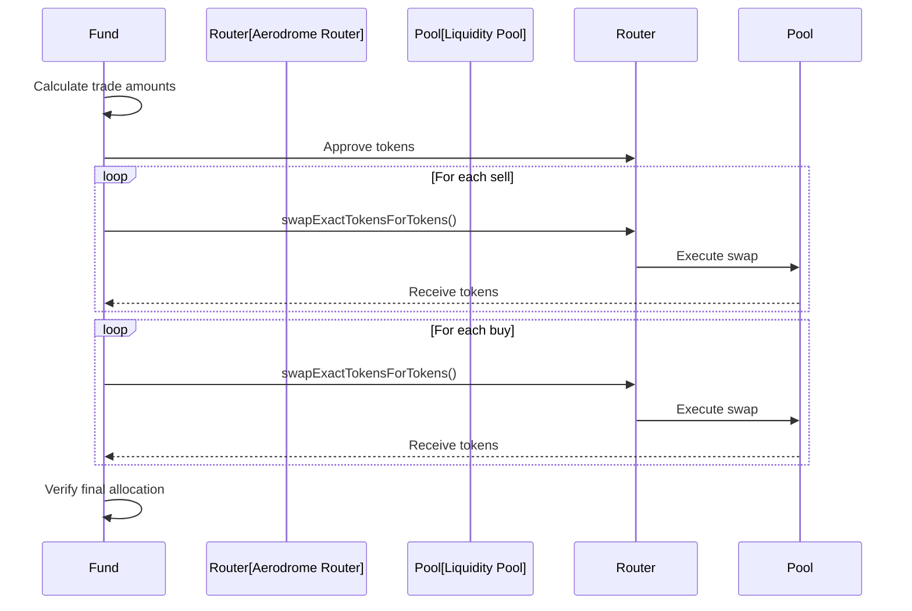

# Portfolio Management

## Overview

Portfolio management in WhackRockFund involves setting target allocations and executing rebalancing operations to maintain those targets. This is primarily the responsibility of the fund's agent.

**Smart Contract Reference**: [WhackRock Treasury Template Repository](https://github.com/WhackRock/whackrock-treasury-template) - `src/funds/WhackRockFundV6_UniSwap_TWAP.sol`

## Target Weight Management

### setTargetWeights()

```solidity
function setTargetWeights(uint256[] calldata _weights) external onlyAgent
```

**Purpose**: Updates the target allocation for fund assets

**Access**: Agent only

**Parameters**:
- `_weights`: Array of target weights in basis points

**Requirements**:
- Caller must be the agent
- Array length must match `allowedTokens` length
- No zero weights allowed
- Sum must equal 10000 (100%)

**Example**:
```solidity
// Set 40% WBTC, 30% WETH, 30% USDC
uint256[] memory weights = [4000, 3000, 3000];
fund.setTargetWeights(weights);
```

### setTargetWeightsAndRebalanceIfNeeded()

```solidity
function setTargetWeightsAndRebalanceIfNeeded(uint256[] calldata _weights) external onlyAgent
```

**Purpose**: Updates weights and immediately rebalances if needed

**Access**: Agent only

**Process**:
1. Updates target weights
2. Checks deviation from current allocation
3. Executes rebalancing if threshold exceeded

**Use Case**: Efficient single transaction for strategy changes

## Rebalancing Mechanism

### Understanding Rebalancing

Rebalancing maintains the fund's target allocation by:
1. Selling overweight assets
2. Buying underweight assets
3. Minimizing trading costs
4. Protecting against slippage

### Rebalancing Triggers



### triggerRebalance()

```solidity
function triggerRebalance() external onlyAgent
```

**Purpose**: Manually forces a rebalancing cycle

**Access**: Agent only

**Use Cases**:
- Market opportunities
- After significant price movements
- Strategy implementation

## Rebalancing Algorithm

### 1. Calculate Current State

```solidity
struct TokenRebalanceInfo {
    address token;
    uint256 currentBalance;
    uint256 currentValueInAccountingAsset;
    uint256 targetValueInAccountingAsset;
    int256 deltaValueInAccountingAsset;
}
```

For each token:
1. Get current balance
2. Convert to WETH value
3. Compare to target allocation
4. Calculate delta (positive = buy, negative = sell)

### 2. Determine Trade Order

The algorithm prioritizes:
1. **Sells before buys** (generate liquidity first)
2. **Largest deviations first** (maximum impact)
3. **Gas efficiency** (batch where possible)

### 3. Execute Swaps



### 4. Slippage Protection

Each swap includes:
```solidity
minAmountOut = expectedAmount * (10000 - DEFAULT_SLIPPAGE_BPS) / 10000
deadline = block.timestamp + SWAP_DEADLINE_OFFSET
```

## Deviation Calculation

### _isRebalanceNeeded()

```solidity
function _isRebalanceNeeded() internal view returns (bool needsRebalance, uint256 maxDeviationBPS)
```

**Process**:
1. Calculate total NAV
2. For each token, compute actual vs target percentage
3. Find maximum deviation
4. Return true if > threshold

**Example Calculation**:
```
Total NAV: 100 WETH
WBTC Value: 35 WETH (35%)
WBTC Target: 40%
Deviation: |35% - 40%| = 5% = 500 BPS
Threshold: 100 BPS (1%)
Needs Rebalance: YES
```

## Portfolio Composition Views

### getTargetCompositionBPS()

```solidity
function getTargetCompositionBPS() external view returns (
    uint256[] memory targetComposition_,
    address[] memory tokenAddresses_,
    string[] memory tokenSymbols_
)
```

**Returns**: Target allocations with token information

**Use Case**: Display target portfolio to users

### getCurrentCompositionBPS()

```solidity
function getCurrentCompositionBPS() external view returns (
    uint256[] memory currentComposition_,
    address[] memory tokenAddresses_,
    string[] memory tokenSymbols_
)
```

**Returns**: Current actual allocations

**Use Case**: Monitor drift from targets

## Agent Strategies

### Conservative Rebalancing
- Set weights infrequently
- Rely on automatic triggers
- Minimize trading costs

```solidity
// Quarterly rebalancing
if (block.timestamp > lastRebalance + 90 days) {
    fund.setTargetWeightsAndRebalanceIfNeeded(newWeights);
}
```

### Active Management
- Frequent weight adjustments
- Manual rebalancing for opportunities
- Tactical allocation changes

```solidity
// Daily strategy updates
fund.setTargetWeights(dailyWeights);
if (marketOpportunity) {
    fund.triggerRebalance();
}
```

### Momentum Following
- Increase weights for performing assets
- Decrease weights for underperformers
- Regular rebalancing

```solidity
// Weekly momentum adjustment
uint256[] memory momentumWeights = calculateMomentumWeights();
fund.setTargetWeightsAndRebalanceIfNeeded(momentumWeights);
```

## Gas Considerations

### Rebalancing Costs

Factors affecting gas usage:
1. **Number of swaps**: More tokens = higher cost
2. **Swap complexity**: Multi-hop routes cost more
3. **Price updates**: Oracle consultations
4. **Event emissions**: Multiple events per rebalance

### Optimization Strategies

1. **Batch Operations**: Change weights and rebalance together
2. **Threshold Tuning**: Higher threshold = less frequent rebalancing
3. **Token Selection**: Fewer tokens = lower rebalancing costs
4. **Timing**: Rebalance during low gas periods

## Security Considerations

### Access Control
- Only agents can modify weights
- Only agents can trigger manual rebalancing
- Automatic rebalancing is permissionless

### Economic Security
- Slippage limits prevent sandwich attacks
- Deadline prevents pending transaction exploits
- Minimum liquidity checks in swaps

### Weight Validation
```solidity
// Must sum to exactly 100%
require(totalWeight == TOTAL_WEIGHT_BASIS_POINTS, "Invalid weights");

// No zero weights
require(weight > 0, "Zero weight not allowed");
```

## Events

### TargetWeightsUpdated
```solidity
event TargetWeightsUpdated(
    address indexed agent,
    address[] tokens,
    uint256[] weights,
    uint256 timestamp
)
```

### RebalanceCheck
```solidity
event RebalanceCheck(
    bool needsRebalance,
    uint256 maxDeviationBPS,
    uint256 currentNAV_AA
)
```

### RebalanceCycleExecuted
```solidity
event RebalanceCycleExecuted(
    uint256 navBeforeRebalanceAA,
    uint256 navAfterRebalanceAA,
    uint256 blockTimestamp,
    uint256 wethValueInUSDC
)
```

### FundTokenSwapped
```solidity
event FundTokenSwapped(
    address indexed tokenFrom,
    uint256 amountFrom,
    address indexed tokenTo,
    uint256 amountTo
)
```

## Best Practices

### For Agents

1. **Plan Weight Changes**: Consider market impact
2. **Monitor Deviations**: Don't let drift accumulate
3. **Gas Efficiency**: Batch operations when possible
4. **Risk Management**: Gradual shifts for large changes

### For Integrators

1. **Subscribe to Events**: Monitor rebalancing activity
2. **Predict Gas Costs**: Use simulation before transactions
3. **Handle Failures**: Rebalancing can fail due to liquidity
4. **Track Performance**: Compare actual vs target allocations

## Example Integration

### Python Monitoring Script
```python
def monitor_fund_allocation(fund_address):
    # Get current composition
    current = fund.getCurrentCompositionBPS()
    target = fund.getTargetCompositionBPS()
    
    # Calculate deviations
    for i, token in enumerate(current[1]):
        current_bps = current[0][i]
        target_bps = target[0][i]
        deviation = abs(current_bps - target_bps)
        
        if deviation > 100:  # 1%
            print(f"{token}: {deviation/100}% off target")
    
    # Check if rebalance needed
    needs_rebalance, max_deviation = fund._isRebalanceNeeded()
    if needs_rebalance:
        notify_agent(f"Rebalance needed: {max_deviation/100}% deviation")
```

### JavaScript Agent Bot
```javascript
async function manageFund(fund) {
    // Calculate new weights based on strategy
    const weights = await calculateOptimalWeights();
    
    // Update weights and rebalance
    const tx = await fund.setTargetWeightsAndRebalanceIfNeeded(weights);
    await tx.wait();
    
    // Log results
    const receipt = await provider.getTransactionReceipt(tx.hash);
    const rebalanceEvents = receipt.logs.filter(
        log => log.topics[0] === REBALANCE_EXECUTED_TOPIC
    );
    
    console.log(`Rebalanced: ${rebalanceEvents.length} swaps executed`);
}
```

## Related Documentation

- [Investment Operations](investment-ops.md) - How rebalancing affects deposits/withdrawals
- [Agent Operations](../integration/agent-operations.md) - Full agent guide
- [Events](events.md) - Detailed event documentation