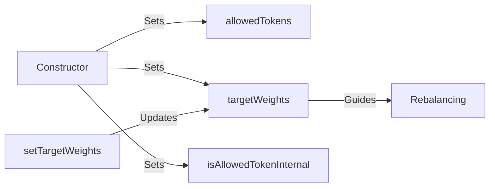
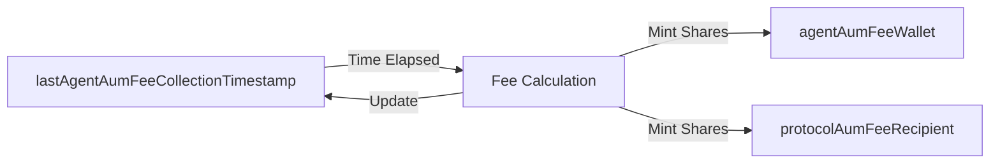

# Fund State Variables

## Overview

This page documents all state variables in the WhackRockFund contract. Unlike constants, these variables can change during the fund's operation (within defined rules).

## Access Control

### agent
```solidity
address public agent;
```
- **Type**: `address`
- **Visibility**: Public
- **Purpose**: Current fund manager (human or AI)
- **Set By**: Constructor, `setAgent()`
- **Modifiable By**: Fund owner only
- **Initial Value**: Set at deployment

## DEX Integration

### dexRouter
```solidity
IAerodromeRouter public immutable dexRouter;
```
- **Type**: `IAerodromeRouter`
- **Visibility**: Public
- **Immutability**: Yes (set once at deployment)
- **Purpose**: Interface to Aerodrome DEX for swaps
- **Usage**: All token swaps during rebalancing

### ACCOUNTING_ASSET
```solidity
address public immutable ACCOUNTING_ASSET;
```
- **Type**: `address`
- **Visibility**: Public
- **Immutability**: Yes
- **Purpose**: Base asset for NAV calculations (WETH)
- **Derived From**: `dexRouter.weth()`
- **Note**: All deposits must be in this asset

### USDC_ADDRESS
```solidity
address public immutable USDC_ADDRESS;
```
- **Type**: `address`
- **Visibility**: Public
- **Immutability**: Yes
- **Purpose**: USD-denominated value calculations
- **Set By**: Constructor parameter

## Portfolio Management

### allowedTokens
```solidity
address[] public allowedTokens;
```
- **Type**: `address[]`
- **Visibility**: Public
- **Purpose**: Array of tokens the fund can hold
- **Set By**: Constructor
- **Immutable After**: Deployment
- **Access**: By index via automatic getter

### targetWeights
```solidity
mapping(address => uint256) public targetWeights;
```
- **Type**: `mapping(address => uint256)`
- **Visibility**: Public
- **Purpose**: Target allocation for each token
- **Unit**: Basis points (10000 = 100%)
- **Set By**: Constructor, `setTargetWeights()`
- **Constraint**: Sum must equal 10000

### isAllowedTokenInternal
```solidity
mapping(address => bool) public isAllowedTokenInternal;
```
- **Type**: `mapping(address => bool)`
- **Visibility**: Public
- **Purpose**: Quick lookup for allowed tokens
- **Set By**: Constructor
- **Immutable After**: Deployment

## Fee Management

### agentAumFeeWallet
```solidity
address public immutable agentAumFeeWallet;
```
- **Type**: `address`
- **Visibility**: Public
- **Immutability**: Yes
- **Purpose**: Recipient of agent's fee shares
- **Set By**: Constructor
- **Note**: Cannot be changed after deployment

### agentAumFeeBps
```solidity
uint256 public immutable agentAumFeeBps;
```
- **Type**: `uint256`
- **Visibility**: Public
- **Immutability**: Yes
- **Purpose**: Annual AUM fee rate
- **Unit**: Basis points (200 = 2% annual)
- **Set By**: Constructor
- **Constraint**: Must be ≤ registry maximum

### protocolAumFeeRecipient
```solidity
address public immutable protocolAumFeeRecipient;
```
- **Type**: `address`
- **Visibility**: Public
- **Immutability**: Yes
- **Purpose**: Recipient of protocol's fee shares
- **Set By**: Constructor (from registry)

### lastAgentAumFeeCollectionTimestamp
```solidity
uint256 public lastAgentAumFeeCollectionTimestamp;
```
- **Type**: `uint256`
- **Visibility**: Public
- **Purpose**: Tracks fee accrual periods
- **Set By**: Constructor, `collectAgentManagementFee()`
- **Initial Value**: Deployment timestamp
- **Update Frequency**: Each fee collection

## Metadata

### baseURI
```solidity
string public baseURI;
```
- **Type**: `string`
- **Visibility**: Public
- **Purpose**: Base URI for token metadata
- **Set By**: Constructor
- **Usage**: Can store IPFS hash or URL
- **Note**: Part of ERC20 metadata

## Inherited State Variables

From **ERC20**:
- `name`: Fund's token name
- `symbol`: Fund's token symbol
- `decimals`: Always 18
- `totalSupply`: Total shares outstanding
- `balanceOf`: Share balances mapping
- `allowance`: Approval mapping

From **Ownable**:
- `owner`: Fund owner address
- Can transfer ownership
- Can change agent
- Can emergency withdraw

## State Variable Interactions

### Portfolio State Flow


### Fee Accrual Flow


## Storage Layout

The fund uses efficient storage patterns:

1. **Immutable Variables**: Set once, no storage slots after deployment
2. **Mappings**: O(1) lookups for weights and allowances
3. **Arrays**: Only for token list iteration
4. **Timestamps**: uint256 for Unix timestamps

## Access Patterns

### Public Getters
All public variables have automatic getters:
```solidity
// Examples
address currentAgent = fund.agent();
uint256 btcWeight = fund.targetWeights(WBTC_ADDRESS);
address token = fund.allowedTokens(0);
```

### State Modifications
| Variable | Who Can Modify | How |
|----------|----------------|-----|
| `agent` | Owner | `setAgent()` |
| `targetWeights` | Agent | `setTargetWeights()` |
| `lastAgentAumFeeCollectionTimestamp` | Anyone | `collectAgentManagementFee()` |
| ERC20 state | System | Deposits/Withdrawals/Fees |

## Security Considerations

### Immutable Variables
Most critical variables are immutable for security:
- Fee recipients cannot be changed
- DEX router cannot be swapped
- Allowed tokens are fixed

### Mutable Variables
Limited mutability reduces attack surface:
- Only owner can change agent
- Only agent can change weights
- Weights must sum to 100%

## Gas Optimization

### Storage Reads
```solidity
// Expensive: Multiple SLOADs
for (uint i = 0; i < allowedTokens.length; i++) {
    uint256 weight = targetWeights[allowedTokens[i]];
}

// Optimized: Cache array
address[] memory tokens = allowedTokens;
for (uint i = 0; i < tokens.length; i++) {
    uint256 weight = targetWeights[tokens[i]];
}
```

### Immutable Benefits
Immutable variables are embedded in bytecode:
- No storage reads (SLOAD)
- Cheaper gas costs
- Better security

## Common Queries

### Get Fund Configuration
```solidity
// Basic info
address agent = fund.agent();
address owner = fund.owner();
uint256 aum = fund.totalNAVInAccountingAsset();

// Portfolio composition
uint256 tokenCount = fund.allowedTokens.length;
for (uint256 i = 0; i < tokenCount; i++) {
    address token = fund.allowedTokens(i);
    uint256 weight = fund.targetWeights(token);
}

// Fee info
uint256 feeRate = fund.agentAumFeeBps();
address feeWallet = fund.agentAumFeeWallet();
```

## Related Documentation

- [Constants](constants.md) - Immutable configuration values
- [Investment Operations](investment-ops.md) - How state changes during deposits/withdrawals
- [Portfolio Management](portfolio-mgmt.md) - Weight management details