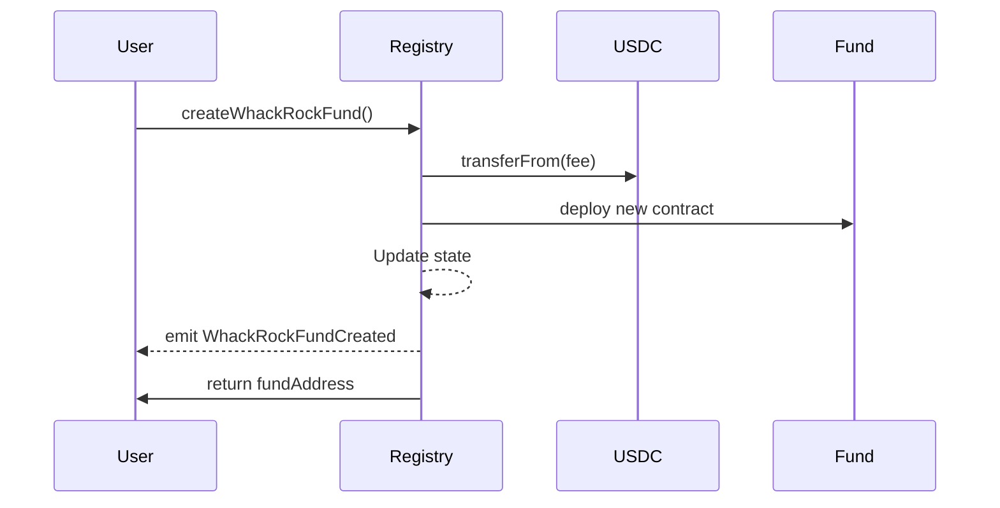
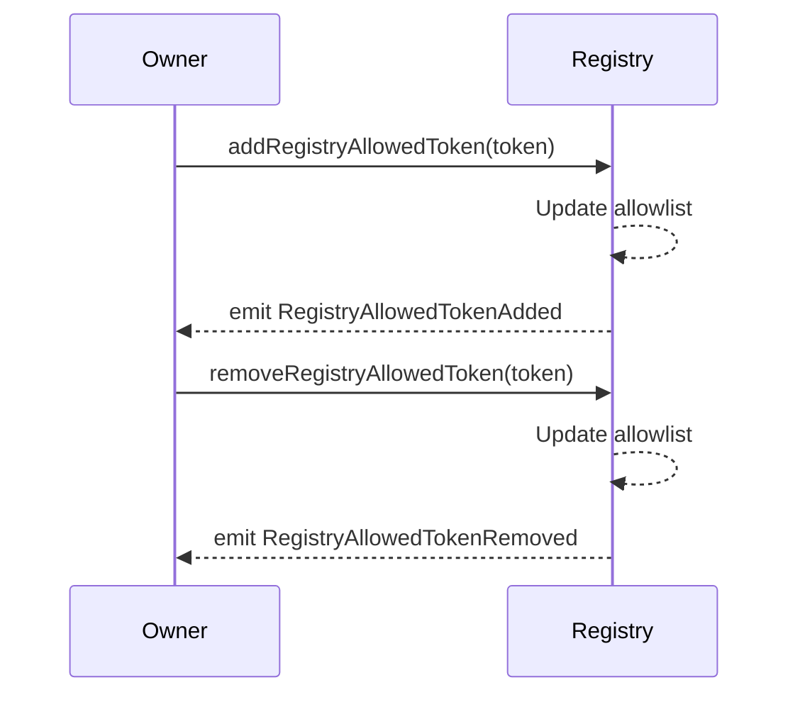

# Registry Events

## Overview

The WhackRockFundRegistry emits events for all significant state changes, enabling off-chain monitoring and indexing of protocol activity.

## Event Definitions

### WhackRockFundCreated

```solidity
event WhackRockFundCreated(
    uint256 indexed fundId,
    address indexed fundAddress,
    address indexed creator,
    address initialAgent,
    string vaultName,
    string vaultSymbol,
    string vaultURI,
    string description,
    address[] allowedTokens,
    uint256[] targetWeights,
    address agentAumFeeWallet,
    uint256 agentTotalAumFeeBps,
    uint256 timestamp
)
```

**Emitted When**: A new fund is successfully created

**Indexed Parameters**:
- `fundId`: Sequential ID of the fund (matches `fundCounter`)
- `fundAddress`: Contract address of the deployed fund
- `creator`: Address that created the fund

**Data Parameters**:
| Parameter | Type | Description |
|-----------|------|-------------|
| `initialAgent` | `address` | Agent managing the fund |
| `vaultName` | `string` | ERC20 name of fund shares |
| `vaultSymbol` | `string` | ERC20 symbol of fund shares |
| `vaultURI` | `string` | Metadata URI |
| `description` | `string` | Fund description |
| `allowedTokens` | `address[]` | Tokens in the fund |
| `targetWeights` | `uint256[]` | Initial target weights |
| `agentAumFeeWallet` | `address` | Agent's fee recipient |
| `agentTotalAumFeeBps` | `uint256` | Total AUM fee rate |
| `timestamp` | `uint256` | Block timestamp |

**Use Cases**:
- Track all fund deployments
- Index funds by creator or agent
- Monitor protocol growth
- Build fund directories

### RegistryAllowedTokenAdded

```solidity
event RegistryAllowedTokenAdded(address indexed token)
```

**Emitted When**: A token is added to the global allowlist

**Indexed Parameters**:
- `token`: Address of the added token

**Use Cases**:
- Update UI token lists
- Monitor new investment options
- Track protocol token coverage

### RegistryAllowedTokenRemoved

```solidity
event RegistryAllowedTokenRemoved(address indexed token)
```

**Emitted When**: A token is removed from the global allowlist

**Indexed Parameters**:
- `token`: Address of the removed token

**Use Cases**:
- Update UI token lists
- Alert fund managers of changes
- Track protocol risk management


Removing a token from the allowlist doesn't affect existing funds that already hold it


### MaxInitialAllowedTokensLengthUpdated

```solidity
event MaxInitialAllowedTokensLengthUpdated(uint256 newLength)
```

**Emitted When**: The maximum number of tokens per fund is changed

**Parameters**:
- `newLength`: New maximum token count

**Use Cases**:
- Update fund creation interfaces
- Track protocol parameter changes

### RegistryParamsUpdated

```solidity
event RegistryParamsUpdated(
    address usdcTokenAddress,
    address whackRockRewardsAddr,
    uint256 protocolCreationFeeUsdc,
    uint256 totalAumFeeBps,
    address protocolAumRecipient,
    uint256 maxAgentDepositFeeBpsAllowed
)
```

**Emitted When**: Registry parameters are updated via `updateRegistryParameters()` or during initialization

**Parameters**:
| Parameter | Type | Description |
|-----------|------|-------------|
| `usdcTokenAddress` | `address` | USDC token contract |
| `whackRockRewardsAddr` | `address` | Creation fee recipient |
| `protocolCreationFeeUsdc` | `uint256` | Fund creation fee amount |
| `totalAumFeeBps` | `uint256` | Maximum AUM fee allowed |
| `protocolAumRecipient` | `address` | Protocol's AUM fee recipient |
| `maxAgentDepositFeeBpsAllowed` | `uint256` | Maximum deposit fee |

**Use Cases**:
- Monitor fee changes
- Track protocol configuration
- Update integration parameters

## Event Monitoring Examples

### Web3.js Example

```javascript
// Listen for new funds
registry.events.WhackRockFundCreated()
  .on('data', (event) => {
    console.log('New fund created:', {
      fundId: event.returnValues.fundId,
      address: event.returnValues.fundAddress,
      creator: event.returnValues.creator,
      agent: event.returnValues.initialAgent,
      symbol: event.returnValues.vaultSymbol
    });
  });

// Listen for token additions
registry.events.RegistryAllowedTokenAdded()
  .on('data', (event) => {
    console.log('Token added:', event.returnValues.token);
  });
```

### Ethers.js Example

```javascript
// Filter for funds by creator
const filter = registry.filters.WhackRockFundCreated(
  null, // any fundId
  null, // any fundAddress
  creatorAddress // specific creator
);

const events = await registry.queryFilter(filter);
events.forEach(event => {
  console.log('Fund by creator:', event.args.fundAddress);
});
```

### The Graph Query Example

```graphql
query GetRecentFunds {
  whackRockFundCreateds(
    first: 10
    orderBy: timestamp
    orderDirection: desc
  ) {
    fundId
    fundAddress
    creator
    initialAgent
    vaultName
    vaultSymbol
    agentTotalAumFeeBps
    timestamp
  }
}
```

## Event Flow Diagrams

### Fund Creation Flow



### Token Management Flow



## Best Practices

### Event Indexing

1. **Index Key Fields**: Always query using indexed parameters for efficiency
2. **Block Ranges**: Use specific block ranges to avoid timeout issues
3. **Event Ordering**: Events within a transaction are ordered by emission

### Event Monitoring

1. **Missed Events**: Implement reconnection logic for websocket subscriptions
2. **Reorg Handling**: Wait for confirmations before considering events final
3. **Rate Limiting**: Implement backoff strategies for RPC providers

### Data Storage

1. **Off-chain Storage**: Store full event data off-chain for complex queries
2. **IPFS Integration**: Resolve URIs from events to fetch metadata
3. **Caching**: Cache frequently accessed event data

## Related Events

While the registry emits its own events, created funds also emit events:
- Fund deployment events
- Agent updates
- Portfolio changes
- Fee collections

See [Fund Events](../fund/events.md) for fund-specific events.

## Troubleshooting

### Common Issues

1. **Missing Events**: Ensure you're listening from the correct block
2. **Decoding Errors**: Verify ABI matches deployed contract version
3. **Performance**: Use filters to reduce event volume

### Event Reliability


Events are part of transaction receipts and are as reliable as the blockchain itself. However, always implement error handling for RPC failures.
