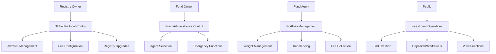

# Access Control

## Overview

WHACKROCK implements a comprehensive access control system across the Registry and Fund contracts. This page details all roles, permissions, and security mechanisms.

## Role Hierarchy



## Registry Access Control

### Registry Owner

**Role**: Complete control over the registry protocol

**Address**: Set during initialization, transferable via OpenZeppelin Ownable

**Permissions**:

| Function | Access | Description |
|----------|--------|-------------|
| `addRegistryAllowedToken()` | ✅ Owner Only | Add token to global allowlist |
| `batchAddRegistryAllowedToken()` | ✅ Owner Only | Add multiple tokens |
| `removeRegistryAllowedToken()` | ✅ Owner Only | Remove token from allowlist |
| `setMaxInitialAllowedTokensLength()` | ✅ Owner Only | Set max tokens per fund |
| `updateRegistryParameters()` | ✅ Owner Only | Update all fee parameters |
| `upgradeTo()` / `upgradeToAndCall()` | ✅ Owner Only | Upgrade registry implementation |

**Critical Responsibilities**:
- Curate token allowlist for security
- Set reasonable fee limits
- Manage protocol upgrades
- Ensure system integrity

**Security Considerations**:
```solidity
// Owner validation is automatic via OpenZeppelin
modifier onlyOwner() {
    _checkOwner();
    _;
}

function _checkOwner() internal view virtual {
    require(owner() == _msgSender(), "Ownable: caller is not the owner");
}
```

### Public Access (Registry)

**Permissions**:

| Function | Access | Description |
|----------|--------|-------------|
| `createWhackRockFund()` | 🌐 Public | Create new funds |
| `getDeployedFundsCount()` | 🌐 Public | Query fund count |
| `getFundAddressByIndex()` | 🌐 Public | Get fund by index |
| `getRegistryAllowedTokens()` | 🌐 Public | View allowlist |
| All view functions | 🌐 Public | Read contract state |

## Fund Access Control

### Fund Owner

**Role**: Administrative control over individual funds

**Address**: Set during fund creation, transferable via OpenZeppelin Ownable

**Permissions**:

| Function | Access | Description |
|----------|--------|-------------|
| `setAgent()` | 🔐 Owner Only | Change fund agent |
| `emergencyWithdrawERC20()` | 🔐 Owner Only | Emergency token withdrawal |
| `emergencyWithdrawNative()` | 🔐 Owner Only | Emergency ETH withdrawal |
| `transferOwnership()` | 🔐 Owner Only | Transfer fund ownership |

**Use Cases**:
- Replace malfunctioning agents
- Recover stuck tokens
- Transfer fund control
- Emergency interventions

### Fund Agent

**Role**: Portfolio management and strategy execution

**Address**: Set during creation, changeable by owner

**Permissions**:

| Function | Access | Description |
|----------|--------|-------------|
| `setTargetWeights()` | 🤖 Agent Only | Update portfolio weights |
| `setTargetWeightsAndRebalanceIfNeeded()` | 🤖 Agent Only | Update weights and rebalance |
| `triggerRebalance()` | 🤖 Agent Only | Force rebalancing |

**Security Implementation**:
```solidity
modifier onlyAgent() {
    if (msg.sender != agent) revert E4(); // Unauthorized
    _;
}
```

**Limitations**:
- Cannot modify fund structure
- Cannot withdraw assets
- Cannot change fee recipients
- Cannot access emergency functions

### Public Access (Fund)

**Permissions**:

| Function | Access | Description |
|----------|--------|-------------|
| `deposit()` | 🌐 Public | Invest WETH for shares |
| `withdraw()` | 🌐 Public | Burn shares for assets |
| `collectAgentManagementFee()` | 🌐 Public | Trigger fee collection |
| All view functions | 🌐 Public | Read fund state |

**Investment Security**:
- Minimum deposit requirements prevent dust attacks
- Share calculations prevent dilution attacks
- Proportional withdrawals ensure fairness

## Permission Matrix

### Complete Access Control Matrix

| Function Category | Registry Owner | Fund Owner | Fund Agent | Public |
|-------------------|----------------|------------|------------|--------|
| **Registry Management** |
| Add/Remove Tokens | ✅ | ❌ | ❌ | ❌ |
| Update Fee Limits | ✅ | ❌ | ❌ | ❌ |
| Registry Upgrades | ✅ | ❌ | ❌ | ❌ |
| **Fund Creation** |
| Create Fund | ✅ | ✅ | ✅ | ✅ |
| **Fund Administration** |
| Change Agent | ❌ | ✅ | ❌ | ❌ |
| Emergency Withdraw | ❌ | ✅ | ❌ | ❌ |
| **Portfolio Management** |
| Set Weights | ❌ | ❌ | ✅ | ❌ |
| Trigger Rebalance | ❌ | ❌ | ✅ | ❌ |
| **Investment Operations** |
| Deposit | ❌ | ❌ | ❌ | ✅ |
| Withdraw | ❌ | ❌ | ❌ | ✅ |
| Collect Fees | ❌ | ❌ | ❌ | ✅ |
| **View Functions** |
| Read State | ✅ | ✅ | ✅ | ✅ |

## Security Mechanisms

### 1. Role Separation

```solidity
// Registry: Owner controls protocol
contract WhackRockFundRegistry is OwnableUpgradeable {
    function addRegistryAllowedToken(address _token) external onlyOwner {
        // Only owner can modify allowlist
    }
}

// Fund: Owner controls administration, Agent controls strategy
contract WhackRockFund is Ownable {
    address public agent;
    
    function setAgent(address _newAgent) external onlyOwner {
        // Only owner can change agent
    }
    
    function setTargetWeights(uint256[] calldata _weights) external onlyAgent {
        // Only agent can manage portfolio
    }
}
```

### 2. Immutable Security Parameters

Critical parameters are immutable after deployment:

```solidity
// Cannot be changed after deployment
address public immutable agentAumFeeWallet;
uint256 public immutable agentAumFeeBps;
address public immutable protocolAumFeeRecipient;
address[] public allowedTokens; // Set once at creation
```

### 3. Input Validation

All functions include comprehensive validation:

```solidity
// Example: Weight validation
function _setTargetWeights(uint256[] calldata _weights) internal {
    if (_weights.length != allowedTokens.length) revert E2();
    
    uint256 totalWeight = 0;
    for (uint256 i = 0; i < _weights.length; i++) {
        if (_weights[i] == 0) revert E2(); // No zero weights
        totalWeight += _weights[i];
    }
    
    if (totalWeight != TOTAL_WEIGHT_BASIS_POINTS) revert E2();
    // Implementation continues...
}
```

## Access Control Patterns

### 1. Multi-Signature Recommendations

For production deployments, consider multi-sig wallets:

```javascript
// Example: Gnosis Safe integration
const gnosisSafe = new ethers.Contract(GNOSIS_SAFE_ADDRESS, GNOSIS_ABI, provider);

// Registry owner should be a multi-sig
await registry.transferOwnership(gnosisSafe.address);

// Fund owners can also be multi-sig for additional security
await fund.transferOwnership(gnosisSafe.address);
```

### 2. Timelock Integration

Add timelock delays for critical operations:

```javascript
// Example: Timelock for registry upgrades
const timelock = new ethers.Contract(TIMELOCK_ADDRESS, TIMELOCK_ABI, owner);

// Queue upgrade with delay
await timelock.schedule(
    registry.address,                    // target
    0,                                   // value
    upgradeCalldata,                     // data
    ethers.ZeroHash,                     // predecessor
    salt,                                // salt
    MINIMUM_DELAY                        // delay
);

// Execute after delay
await timelock.execute(/* ... */);
```

### 3. Agent Key Management

Best practices for agent key security:

```javascript
// 1. Use hardware wallets for agent keys
const agent = new ethers.Wallet(AGENT_PRIVATE_KEY, provider);

// 2. Implement key rotation
async function rotateAgentKey(fundAddress, newAgentAddress) {
    const fund = new ethers.Contract(fundAddress, FUND_ABI, currentOwner);
    await fund.setAgent(newAgentAddress);
}

// 3. Monitor agent activity
fund.on('TargetWeightsUpdated', (agent, tokens, weights, timestamp) => {
    console.log(`Agent ${agent} updated weights at ${timestamp}`);
});
```

## Security Monitoring

### 1. Event-Based Monitoring

Monitor critical access control events:

```javascript
// Registry monitoring
registry.on('OwnershipTransferred', (previousOwner, newOwner) => {
    console.log(`Registry ownership transferred: ${previousOwner} -> ${newOwner}`);
});

// Fund monitoring
fund.on('AgentUpdated', (oldAgent, newAgent) => {
    console.log(`Fund agent changed: ${oldAgent} -> ${newAgent}`);
});

fund.on('OwnershipTransferred', (previousOwner, newOwner) => {
    console.log(`Fund ownership transferred: ${previousOwner} -> ${newOwner}`);
});
```

### 2. Access Validation

Regularly verify access control:

```javascript
async function validateAccessControl(fundAddress) {
    const fund = new ethers.Contract(fundAddress, FUND_ABI, provider);
    
    const checks = {
        ownerIsValid: false,
        agentIsValid: false,
        feeRecipientsValid: false
    };
    
    // Check owner
    const owner = await fund.owner();
    checks.ownerIsValid = owner !== ethers.ZeroAddress;
    
    // Check agent
    const agent = await fund.agent();
    checks.agentIsValid = agent !== ethers.ZeroAddress;
    
    // Check fee recipients
    const agentFeeWallet = await fund.agentAumFeeWallet();
    const protocolFeeRecipient = await fund.protocolAumFeeRecipient();
    checks.feeRecipientsValid = 
        agentFeeWallet !== ethers.ZeroAddress && 
        protocolFeeRecipient !== ethers.ZeroAddress;
    
    return checks;
}
```

## Common Security Issues

### 1. Front-Running Protection

Agent operations are protected against front-running:

```solidity
// Weight updates are atomic with rebalancing
function setTargetWeightsAndRebalanceIfNeeded(uint256[] calldata _weights) external onlyAgent {
    _setTargetWeights(_weights);
    // Immediate rebalancing prevents front-running
    (bool needsRebalance,) = _isRebalanceNeeded();
    if (needsRebalance && totalSupply() > 0) {
        _rebalance();
    }
}
```

### 2. Sandwich Attack Prevention

Rebalancing includes slippage protection:

```solidity
// All swaps include minimum output amounts
uint256 minAmountOut = expectedAmount * (TOTAL_WEIGHT_BASIS_POINTS - DEFAULT_SLIPPAGE_BPS) / TOTAL_WEIGHT_BASIS_POINTS;

router.swapExactTokensForTokens(
    amountIn,
    minAmountOut,  // Slippage protection
    path,
    address(this),
    deadline
);
```

### 3. Reentrancy Protection

Investment operations follow checks-effects-interactions:

```solidity
function deposit(uint256 amountWETHToDeposit, address receiver) external returns (uint256 sharesMinted) {
    // Checks
    if (amountWETHToDeposit < MINIMUM_DEPOSIT) revert E2();
    if (receiver == address(0)) revert E1();
    
    // Effects
    sharesMinted = /* calculation */;
    _mint(receiver, sharesMinted);
    
    // Interactions (external calls last)
    IERC20(ACCOUNTING_ASSET).safeTransferFrom(msg.sender, address(this), amountWETHToDeposit);
}
```

## Best Practices

### 1. Principle of Least Privilege

- Registry owner: Only protocol-level changes
- Fund owner: Only administrative functions
- Fund agent: Only portfolio management
- Public: Only investment operations

### 2. Multi-Signature Requirements

For production systems:
- Registry owner should be multi-sig
- High-value fund owners should be multi-sig
- Consider agent multi-sig for institutional funds

### 3. Regular Access Reviews

- Audit ownership changes
- Monitor agent activity
- Verify fee recipient addresses
- Check for unexpected permissions

### 4. Emergency Procedures

Establish clear procedures for:
- Compromised agent keys
- Registry owner key loss
- Fund owner emergencies
- Protocol upgrades

## Related Documentation

- [Economic Security](economic-security.md) - Financial attack vectors
- [Best Practices](best-practices.md) - Security recommendations
- [Audit Notes](audit-notes.md) - Areas requiring special attention